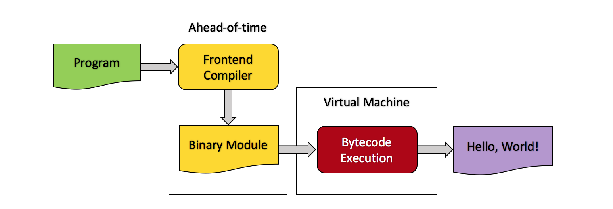

## Base9 Overview

Base9 is an educational **language runtime**. It's front-end language, b9porcelain, is a small subset of JavaScript. It compiles into a simple set of **bytecodes** which run on a primitive **interpreter**. We've also plugged in [OMR] and [JitBuilder] to provide our runtime with a **JIT compiler**!

[OMR]: https://www.eclipse.org/omr/
[JitBuilder]: https://developer.ibm.com/open/2016/07/19/jitbuilder-library-and-eclipse-omr-just-in-time-compilers-made-easy/

## Base9 Architecture

<figure class="image">
  
</figure>

Base9 is comprised of two major components:

#### 1. Ahead of Time (AOT) Compilation Unit

The AOT compilation unit is where the base9 source code is tranformed into a binary module containing bytecodes and metadata about the program. This module will be used as input to the VM at runtime.

#### 2. Virtual Machine / Runtime Unit
At runtime, the binary module is given to the VM as input. The VM deserializes the module and converts it to an in memory data structure. We will refer to this data structure, henceforth, as the "in memory module". The bytecodes in the in memory module are then either interpreted or JIT compiled.

To learn more about the repository layout of our project, see our [Directory Structure] page. 

[Directory Structure]: ./DirectoryStructure.md
