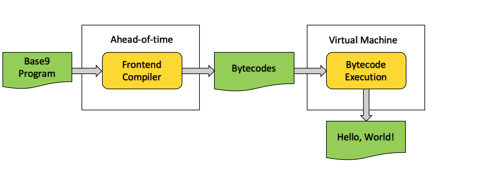
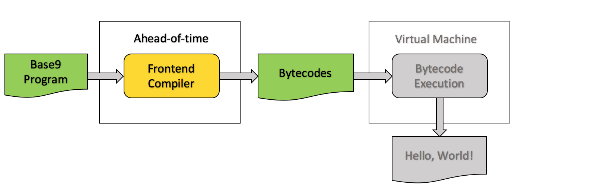
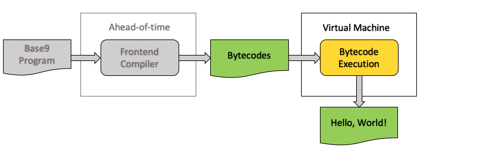
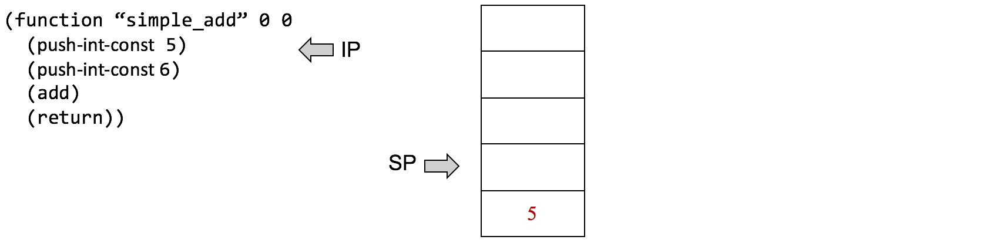
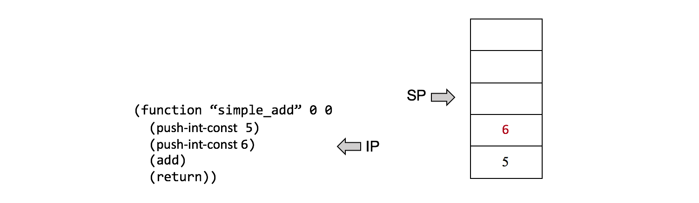
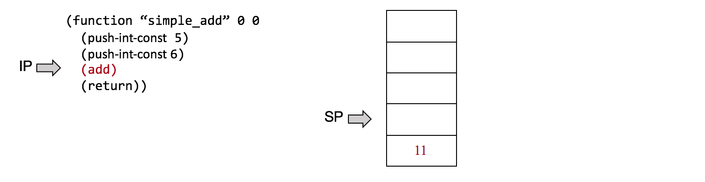
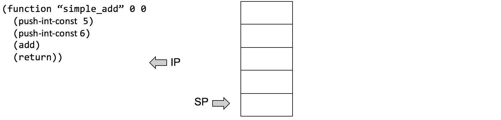
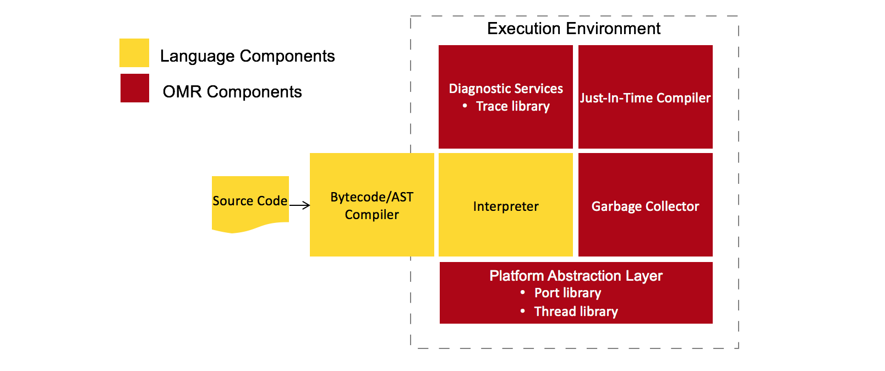
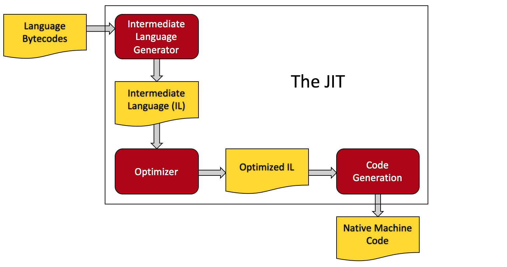

* Table of Contents
{:toc}

## Intro

Welcome to the tutorial! If you're interested in building your own [language runtime], you've come to the right place. Base9 is a miniature language runtime, and thanks to [OMR] and [JitBuilder], it even has a [Just In Time (JIT) Compiler]! The goal of this tutorial is not to teach you how to build base9, but rather to pack your arsenal full of tools to build your own language runtime. We don't want to bog down the tutorial with information you don't need, so we'll keep things straightfoward, providing useful links/definitions along the way for you to peruse at your own convenience. If you'd like to get familiar with some of the vocabulary you'll encounter, feel free to visit the [tutorial dictionary].

[language runtime]: ./Dictionary.md#language-runtime
[OMR]: https://www.eclipse.org/omr/
[JitBuilder]: https://developer.ibm.com/open/2016/07/19/jitbuilder-library-and-eclipse-omr-just-in-time-compilers-made-easy/ 
[Just In Time (JIT) Compiler]: ./Dictionary.md#jit-compiler
[tutorial dictionary]: ./Dictionary.md


### Base9 Setup

Before getting started, you should [get yourself setup with base9]. We're going to use it throughout the tutorial to explore and learn about language runtime concepts. Don't forget to read [about base9] before getting started.

[get yourself setup with base9]: ./SetupBase9.md
[about base9]: ./AboutBase9.md


### Base9 Overview

Base9 has several major components that we'll discuss throughout the course of this tutorial. We'll provide insight about design decisions and implementation. Many of the design and implementation decisions were made based on the specific needs of the project. You may wish to deviate from these decisions along the way in order to best suit your own project.

<figure class="image">
  
</figure>

The above diagram details the two high-level components of the base9 architecture: the [ahead-of-time compilation] (AOT) and the [virtual machine] (VM) units. The AOT unit runs the frontend language through the frontend compiler (the base9 frontend language is a primitive subset of JavaScript). The frontend compiler outputs the [bytecodes] to be consumed by the VM. The VM (or runtime unit) will either execute tbe bytecodes one by one using the [interpreter], or it can employ the [JIT compiler] to produce optimized native machine code.

[ahead-of-time compilation]: ./Dictionary.md#ahead-of-time-compilation
[virtual machine]: ./Dictionary.md#virtual-machine
[bytecodes]: ./Dictionary.md#bytecode
[interpreter]: ./Dictionary.md#interpreter
[JIT compiler]: ./Dictionary.md#jit-compiler

```


```

## Base9 Frontend

<figure class="image">
  
</figure>

### Frontend Language

Our frontend language is a primitive subset of JavaScript. Currently, it can only operate on integers. Let's have a look at some code:
 
 ```js
function b9main() {
  b9PrintString("Hello World!");
}
```

Above is a classic program that we all know and love, Hello, World! The source code can be found in [test/hello.src]. The `b9main` function is always the entry point to a program, like `int main` in C. `b9PrintString` is a method from a tiny library of functions that will be compiled with every program. The library is called b9stdlib and can be found in [b9/js_compiler/b9stdlib.src]. The functions in b9stdlib all call base9 [primitive functions]. In the Hello, World! program, `b9main` uses `b9PrintString` from b9stdlib to write text to console.

[test/hello.src]: https://github.com/b9org/b9/blob/master/test/hello.src
[primitive functions]: ./Dictionary.md#primitive-function
[b9/js_compiler/b9stdlib.src]: https://github.com/b9org/b9/blob/master/js_compiler/b9stdlib.src


### Frontend Compiler

The frontend compiler is in [js_compiler/compiler.js]. It takes the source code and uses [Esprima] to convert the program into an [abstract syntax tree] (or AST). The frontend compiler walks the AST and converts it into a portable binary format. This portable binary format is represented as a [binary module].

[js_compiler/compiler.js]: https://github.com/b9org/b9/blob/master/js_compiler/compile.js
[frontend compiler]: https://github.com/b9org/b9/blob/master/js_compiler/compile.js
[Esprima]: http://esprima.org
[abstract syntax tree]: https://en.wikipedia.org/wiki/Abstract_syntax_tree
[binary module]: ./Dictionary.md#binary-module

For a brief overview of the frontend compiler, as well as a more in depth look at the binary module, visit the link below:

[Frontend Compiler and Binary Format](./FrontendAndBinaryMod.md)

Let’s convert the Hello, World! program to its binary format by running it through the frontend compiler. Hello, World! is in [b9/test/hello.src].

[b9/test/hello.src]: https://github.com/b9org/b9/blob/master/test/hello.src

From the root directory, run:

`node js_compiler/compile.js test/hello.src hello.b9mod`

The above command will run the frontend compiler on `test/hello.src` and output a binary module with the name `hello.b9mod`. If you run the above command, you'll see `hello.b9mod` in the base9 root directory. The `.b9mod` files are in raw hexadecimal format, and are legible using a hex editor like `dhex`.

```


```

## Base9 Backend

<figure class="image">
  
</figure>

Let's explore the VM design in greater detail.

<figure class="image">
  
</figure>

The above diagram shows the components of the VM in detail. The VM takes the binary module and uses the deserializer to convert it into an in-memory Module containing the bytecodes. After the conversion, the VM will employ either the interpreter or the JIT to run the program. The interpreter processes the bytecodes directly and one at a time. The JIT converts the bytecodes to native machine code and returns a function pointer. Once a program is JIT compiled, the bytecodes are no longer interpreted. Instead, the JIT compiled version is always executed. Currently, when we run the JIT, we employ user flags to tell the VM to JIT compile an entire program and to interpret nothing.


### The Deserializer

The base9 [deserializer] at [b9/src/deserialize.cpp] is responsible for taking the binary module and converting it to the in-memory Module. The deserializer is used in base9 in two different ways. Firstly, it's used by the VM to convert a binary module to an in-memory Module. Secondly, it is used by the disassembler at [b9/b9disasm/b9disasm.cpp]. The disassembler employs the deserializer to convert a binary module into an assembly-like interpretation, which we're calling [base9 assembly]. It's primarily used for debugging. Click the link below to learn more:

[deserializer]: ./Dictionary.md#deserializer
[b9/src/deserialize.cpp]: https://github.com/b9org/b9/blob/master/b9/src/deserialize.cpp
[b9/b9disasm/b9disasm.cpp]: https://github.com/b9org/b9/blob/master/b9disasm/b9disasm.cpp
[base9 assembly]: ./B9Assembly.md

[Base9 Disassembler](./Disassembler.md)

Let's run the disassembler using the binary module we just generated! Navigate to the build directory and run the following command:

`b9disasm/b9disasm ../hello.b9mod`

You should now be looking at a human readable version of the Hello, World! program as represented by [base9 assembly]. You'll notice that the first three functions (`b9PrintString`, `b9PrintNumber`, and `b9PrintStack`) are the b9stdlib functions that are included in each compiled program. They can be ignored. The important part is the `b9main` function. Let's have a look at the transition between the JavaScript and the base9 assembly:

[base9 assembly]: ./Dictionary.md#base9-assembly

```js
function b9main() {
  b9PrintString("Hello World!");
}
```

<figure class="image">
  
</figure>

```
(function "b9main" 0 0
  0  (str_push_constant 0)
  1  (function_call 0)
  2  (drop)
  3  (int_push_constant 0)
  4  (function_return)
  5  (end_section))
```

Stepping through the bytecodes as represented by the base9 assembly:
- `str_push_constant` pushes the string "Hello, World!" onto the operand stack
- `function_call` does the call to `b9PrintString`
- `drop` drops the top value from the operand stack (which was holding the unused return value of `b9PrintString`)
- `int_push_constant` pushes 0 onto the operand stack as the return value of `b9main`
- `function_return` does the actual return
- `end_section` is the end-of-bytecodes marker, a safety feature should the interpreter continue running after the return


### Base9 Bytecodes

Now that we've output some bytecodes, let's talk about their design.

The base9 instruction set is stack oriented, which allows for straight-forward compilation and simple VM implementation. All instructions operate on the operand stack, which can be thought of as the VM's memory. One advantage of a stack-based instruction set over a register-based model is that stack-based instructions are smaller, with no need for a register immediate. One disadvantage is that the total number of instructions is larger.

All of the base9 bytecodes are fixed-width. This puts constraints on what we can encode in the instructions, but it simplifies instruction decoding and jumps.

Finally, the base9 instruction set is untyped. This means that the bytecodes can operate on values of varying types. The way this works is by popping the operands off the operand stack, checking their types, and doing the correct operation once the type is known.  

All base9 bytecodes are defined in [b9/include/b9/instructions.hpp].

[b9/include/b9/instructions.hpp]: https://github.com/b9org/b9/blob/master/b9/include/b9/instructions.hpp


### The Operand Stack

As mentioned, the base9 bytecodes are stack oriented. Let's take a look at what happens with the operand stack during a simple addition function:

```javascript
function simple_add() {
  return 5 + 6;
} 
```

The following diagrams display the bytecodes generated from the "simple_add()" function. 

**IP** = Instruction Pointer

**SP** = Stack Pointer

Push 5 onto the operand stack:
<figure class="image">
  
</figure>

Push 6 onto the operand stack:
<figure class="image">
  
</figure>

Pop 5 and 6 off that stack, add them, push the result to the operand stack:
<figure class="image">
  
</figure>

Pop and return the result from the operand stack:
<figure class="image">
  
</figure>


### The Virtual Machine

Now that we've learned a bit about the bytecodes, let's run the VM with the Hello, World! binary module that we generated earlier. From the `build/` directory, run the following command: 

`b9run/b9run ../hello.b9mod`

You should see the following output:

```
Hello World!

=> (integer 0)
```

The `=> (integer 0)` is the return code of the program.


### The Interpreter

The interpreter's job is to take a sequence of bytecodes and match each of them with a corresponding C++ function. This relationship is one-to-one. Earlier, when we ran our Hello, World! program, it ran by default on the interpreter. The VM will always run the interpreter by default. The base9 interpreter is very simple, consisting of a while-loop and switch statement to iterate a sequence of bytecodes. Let's take a look at some pseudocode for the interpreter:

```
interpreter (function) {
  for all bytecodes in the function {
    switch(bytecode) {
      case functionCall
        doFunctionCall()
      case functionReturn
        doFunctionReturn()
      
      ...
      
      case integerAdd
        dointegerAdd()
      case integerSubtract
        doIntegerSubtract()
      
      ...

    }
  }
}
```

Hopefully the pseudocode has convinced you that the interpreter is actually super simple. Essentially, it's a loop around a switch statement, matching bytecodes to corresponding C++ functions.

```


```

## Base9 Implementation

### The `main` function

Recall the command for running the VM with a binary module (from the `build/` directory):

`b9run/b9run ../hello.b9mod`

The entry point for `b9run` can be found in [b9run/main.cpp]. Let's take a look a the `main` function: 

[b9run/main.cpp]: https://github.com/b9org/b9/blob/master/b9run/main.cpp

```cpp
int main(int argc, char* argv[]) {
  OMR::Om::ProcessRuntime runtime;
  RunConfig cfg;

  if (!parseArguments(cfg, argc, argv)) {
    std::cerr << usage << std::endl;
    exit(EXIT_FAILURE);
  }

  ... 

  try {
    run(runtime, cfg);
  }

  ...

  exit(EXIT_SUCCESS);
}
```

The first thing that occurs in `main` is the instatiation of `ProcessRuntime` and `RunConfig`. `ProcessRuntime` does a process wide initialization for the `om` libary, which provides OMR with facilities for garbage collected objects. No need to worry about it, because other than the instantiation, it takes care of itself!

`RunConfig` is a struct (inside of [b9run/main.cpp]), which sets up the base9 global configuration:

```cpp
struct RunConfig {
  b9::Config b9;
  const char* moduleName = "";
  const char* mainFunction = "b9main";
  std::size_t loopCount = 1;
  bool verbose = false;
  std::vector<b9::StackElement> usrArgs;
};
```

Note the `Config` struct in `RunConfig`: 

```cpp
struct Config {
  std::size_t maxInlineDepth = 0;  //< The JIT's max inline depth
  bool jit = false;                //< Enable the JIT
  bool directCall = false;         //< Enable direct JIT to JIT calls
  bool passParam = false;          //< Pass arguments in CPU registers
  bool lazyVmState = false;        //< Simulate the VM state
  bool debug = false;              //< Enable debug code
  bool verbose = false;            //< Enable verbose printing and tracing
};
```

When we run `b9run`, we can run it with a number of options. The command structure for `b9run` is as follows:

`b9run [<option>...] [--] <module> [<arg>...]`

Try running `b9run/b9run -help` from the build directory.

The `RunConfig` and `Config` structs have a default configuration, but this default may be overridden according to the command line options provided by the user. All of the options listed using the `-help` option reside in either the `RunConfig` or the `Config` struct. We use these options to configure the JIT with a number of settings at startup.

Back to the `main` function, the next thing to occur is the argument parsing. This is where `RunConfig` and `Config` may be modified. 

The final thing to occur in `main` is a call to `run(runtime, cfg)`. We wrapped this call in a `try` block, because there are plenty of things that could go wrong when running the VM, and proper error handling is next to godliness.


### The `run` function

Let's look at the `run` function called by `main`:

```
static void run(OMR::Om::ProcessRuntime& runtime, const RunConfig& cfg) {
  b9::VirtualMachine vm{runtime, cfg.b9};

  std::ifstream file(cfg.moduleName, std::ios_base::in | std::ios_base::binary);
  auto module = b9::deserialize(file);
  vm.load(module);

  if (cfg.b9.jit) {
    vm.generateAllCode();
  }

  size_t functionIndex = module->getFunctionIndex(cfg.mainFunction);
  for (std::size_t i = 0; i < cfg.loopCount; i += 1) {
    auto result = vm.run(functionIndex, cfg.usrArgs);
    std::cout << std::endl << "=> " << result << std::endl;
  }
}
```

`run` is where the `VirtualMachine` class is instantiated. `VirtualMachine` can be found in [b9/include/b9/VirtualMachine.hpp]. The `run` function deserializes a binary module which has been compiled from JavaScript source code, and loads the resulting in-memory Module into the VM. Next, it checks if the JIT has been turned on. If yes, the bytecodes are JIT compiled using the `generateCode` function. If no, the VM obtains the main function of the program and begins interpreting.


### The in-memory `Module`

As mentioned, the in-memory Module is created by deserializing a [binary module]. Let's have a look at the `Module` class:

```cpp
struct Module {
  std::vector<FunctionDef> functions;
  std::vector<std::string> strings;

  std::size_t getFunctionIndex(const std::string& name) const {
    for (std::size_t i = 0; i < functions.size(); i++) {
      if (functions[i].name == name) {
        return i;
      }
    }
    throw FunctionNotFoundException{name};
  }
};
```

The Module contains only 2 fields; a `functions` vector, and a `strings` vector. `functions` contains a set of function definitions, or `FunctionDef`'s. The `strings` vector in the Module contains the contents of the string table, which holds any strings used by the JavaScript program. Lastly, there's `getFunctionIndex`, which traverses the `functions` vector using a function name, and returns that function's position in the vector. 


### The `functionDef` struct

Now let's look at our `FunctionDef` struct: 

```cpp
struct FunctionDef {

  ...

  // Function Data
  std::string name;
  uint32_t index;
  std::uint32_t nargs;
  std::uint32_t nregs;
  std::vector<Instruction> instructions;
};
```

The fields of the `FunctionDef` are the function name, the index in the function vector, the number of arguments, the number of registers, and the `Instructions` vector (which contains the bytecodes).

### The base9 Instruction Set

The base9 VM executes it’s own instruction set. The instructions are compiled from the frontend language. Each instruction is a 32-bit little-endian value, which encodes an opcode (AKA a bytecode), and an optional parameter. The opcode is the most significant byte of the instruction. It tells the VM which functionality to execute. The opcode is one of the special predefined constants that the VM understands. Example opcodes are `int_add`, `int_sub`, `int_jmp_eq`, and `function_return`. Each opcode corresponds with a unique hexadecimal value between 0 and n, where n is the total number of bytecodes.

The parameter encodes the constant data about an instruction. For example, a jump instruction encodes it’s jump target in the parameter. The parameter is a signed value stored in the lower 24 bits of the instruction.

The layout of the instructions is:

```
|0000-0000 0000-0000 0000-0000 0000-0000
|---------| bytecode (8 bits)
          |-----------------------------| parameter (24 bits)
```

Instructions are encoded as:

```cpp
std::uint32_t instruction := (opcode << 24) | (parameter &0xFFFFFF);
```

To decode an instructions opcode:

```cpp
std::uint8_t opcode = instruction >> 24;
```

Decoding the parameter is a little more involved. Since the parameter is signed, we must sign extend the 24-bit value as we convert it to 32 bits:

```cpp
std::uint32_t parameter = instruction & 0xFFFFFF;
bool is_signed = parameter & (1 << 23);
if (is_signed)
  parameter |= 0xFF << 24;
```


### The `OperandStack`

The `OperandStack` class is what we have previously referred to as [the operand stack]. It's definition can be found in [b9/include/b9/OperandStack.hpp]. The `OperandStack` class contains functions for using/manipulating the operand stack, and it's fields are as follows: 

[the operand stack]: #the-operand-stack
[b9/include/b9/OperandStack.hpp]: https://github.com/b9org/b9/blob/master/b9/include/b9/OperandStack.hpp

```cpp
StackElement *top_;
StackElement stack_[SIZE];
```

The operand stack acts as the VM's memory bank, storing all of the values needed by the instructions. To see how the operand stack operates during a simple add function, see [the operand stack] section above. As you've likely noticed, base9 is using a `StackElement` type, which is defined in [b9/include/b9/OperandStack.hpp] as follows:

[b9/include/b9/OperandStack.hpp]: https://github.com/b9org/b9/blob/master/b9/include/b9/OperandStack.hpp

```cpp
using StackElement = Om::Value;
```

The StackElement type comes from Om, an OMR toolkit for dealing with garbage collected objects. A `StackElement` is a 64-bit value that encodes a type and a payload. The value can hold a double, a GC reference, a valid memory pointer, or a 32-bit integer.


### The Interpreter Loop

The interpreter is implemented in [b9/src/ExecutionContext.cpp]. It uses the `OperandStack` to store the values needed by the instructions. When a function call occurs, the arguments to the function are pushed onto the operand stack before entering the function. Once the function is entered, the arguments are popped off and used. Let's take a look at the code:

[b9/src/ExecutionContext.cpp]: https://github.com/b9org/b9/blob/master/b9/src/ExecutionContext.cpp

```cpp
StackElement ExecutionContext::interpret(const std::size_t functionIndex) {
  auto function = virtualMachine_->getFunction(functionIndex);
  auto argsCount = function->nargs;
  auto jitFunction = virtualMachine_->getJitAddress(functionIndex);

  if (jitFunction) {
    return callJitFunction(jitFunction, argsCount);
  }

  // interpret the method otherwise
  const Instruction *instructionPointer = function->instructions.data();

  StackElement *args = stack_.top() - function->nargs;
  stack_.pushn(function->nregs);

  ...

```

As you can see, the second last line is popping the functions arguments off the operand stack. Let's back up. The first bit of the `interpret` function deals with some initial setup. The single parameter is `functionIndex`, which we use to get the individual function we wish to interpret. The interpreter then checks if the particular function has previously been JIT compiled. If it has, we use that function instead, and return from the interpreter. If it hasn't, the `instructionPointer` is initialized to the start of the instruction sequence, the arguments are collected from the top of the operand stack, and storage for local variables is allocated on the operand stack.

Now let's take a look at the while-loop and switch-statement.

```cpp
  while (*instructionPointer != END_SECTION) {
    switch (instructionPointer->byteCode()) {

      ...

      case ByteCode::FUNCTION_RETURN: {
        auto result = stack_.pop();
        stack_.restore(args);
        return result;
        break;
      }

      ...

      case ByteCode::INT_ADD:
        doIntAdd();
        break;

     ...

```

We've excluded much of the interpreter loop for simplicity, but we'll discuss a couple of the cases to give you an idea of how it works. Above we have the `FUNCTION_RETURN` bytecode case and the `INT_ADD` bytecode case. In the `FUNCTION_RETURN` case, the top of the operand stack (which is storing the return value of the function) is popped and stored in the `result` variable. The operand stack is then restored and the return value is returned. This is the only bytecode in the interpreter loop that returns a value, which makes sense, because this bytecode is only reached at the end of a function when there are no more bytecodes to process. The `INT_ADD` bytecode case calls `doIntAdd()`, which is a simple C++ function:

```cpp
void ExecutionContext::doIntAdd() {
  std::int32_t right = stack_.pop().getInteger();
  std::int32_t left = stack_.pop().getInteger();
  StackElement result;
  result.setInteger(left + right);
  push(result);
}
```

In summary, the interpreter is simply a mechanism for translating the bytecodes into C++. It’s one-at-a-time bytecode processing makes it inherently slow, which makes the JIT compiler an important part of reducing execution time.


### Summary

The VM has two ways of handling the Module. It can either execute the Module's bytecodes line by line in the interpreter, or it can choose to JIT compile the bytecodes and run that version instead. The interpreter processes the bytecodes directly and one at a time. The JIT compiler converts the bytecodes to native machine code and returns a pointer to the start of the code.

To run the VM using just the interpreter:

`./b9run/b9run <binary_module>`

A reminder that the above command should be run from the `/build` directory.

To conclude this section, let's briefly walk over the components we've covered thus far. JavaScript is the frontend language. It is compiled using the frontend compiler, which employs Esprima. The output of the frontend compiler is the binary module. The binary module is consumed by the deserializer in [b9/src/deserialize.cpp], which converts it to the in-memory Module to be run by the VM. The VM is itself a C++ class, and can be found in [b9/include/b9/VirtualMachine.hpp]. Once instantiated, the VM loads and runs the Module through the interpreter in [b9/src/ExecutionContext.cpp].

[b9/src/deserialize.cpp]: https://github.com/b9org/b9/blob/master/b9/src/deserialize.cpp
[b9/include/b9/VirtualMachine.hpp]: https://github.com/b9org/b9/blob/master/b9/include/b9/VirtualMachine.hpp
[b9/src/ExecutionContext.cpp]: https://github.com/b9org/b9/blob/master/b9/src/ExecutionContext.cpp

```


```

## OMR and JitBuilder


### OMR

[OMR] is an open source and reusable C++ library for building language runtimes. It is designed to run on many different hardware and operating system platforms. It contains a JIT compiler, garbage collection, a platform porting library, a thread library, diagnostic services, and monitoring services. It's language agnostic functionality allows developers to easily bootstrap their own language runtimes. It is most notably employed in [OpenJ9], IBM's open sourced Java Virtual Machine, but has also been integrated with Ruby, CSOM, Lua, Swift, and Rosie Pattern Language.

[OMR]: https://www.eclipse.org/omr/
[OpenJ9]: https://www.eclipse.org/openj9/

<figure class="image">
  <figcaption>OMR Overview</figcaption>
  
</figure>

The above diagram depicts the base9 components in yellow. These are the components that a developer must implement independantly. The red areas are the components belonging to OMR.


### JitBuilder

[JitBuilder] is an interface to the JIT compiler technology in OMR. It's designed to bootstrap a native-code JIT compiler for interpreted methods, and it allows the user to programatically describe the [intermediate language] (IL) that implements the semantics of the bytecodes. Using JitBuilder to employ the OMR JIT is not strictly necessary, but without it, one would require a deep understanding of JIT Compilation. JitBuilder makes it possible for someone without a background in compilers to easily plug-in and use the JIT compiler for their runtime.

[JitBuilder]: https://developer.ibm.com/open/2016/07/19/jitbuilder-library-and-eclipse-omr-just-in-time-compilers-made-easy/
[intermediate language]: ./Dictionary.md#intermediate-language

```


```

## Integrate the JIT Compiler

### Run the JIT

As mentioned earlier, our JIT compiler is made possible by [OMR] and [JitBuilder]. OMR is kept in the [third_party] directory as a [git submodule]. JitBuilder is part of OMR. The JIT compiler is one of the two ways the VM can run the module (the other being the interpreter). Where the interpreter processes the bytecodes directly and one at a time, the JIT compiler converts the bytecodes to native machine code and returns a pointer to the start of the compiled code. Currently, we employ user flags to tell the VM to JIT compile an entire program and to interpret nothing. We aim to add profiling to base9, which will allow the VM to record statistics about the program and to make decisions about which individual functions to JIT compile.

[OMR]: https://eclipse.org/omr/
[JitBuilder]: https://developer.ibm.com/open/2016/07/19/jitbuilder-library-and-eclipse-omr-just-in-time-compilers-made-easy/
[third_party]: https://github.com/b9org/b9/tree/master/third_party
[git submodule]: ./Dictionary.md#git-submodule

So how do we run a fully JIT compiled program? From `build/` directory, run:

`./b9run/b9run -help`

You should see the following output:

```
Usage: b9run [<option>...] [--] <module> [<arg>...]
   Or: b9run -help
Jit Options:
  -jit:          Enable the jit
  -directcall:   make direct jit to jit calls
  -passparam:    Pass arguments in CPU registers
  -lazyvmstate:  Only update the VM state as needed
Run Options:
  -function <f>: Run the function <f> (default: b9main)
  -loop <n>:     Run the program <n> times (default: 1)
  -inline <n>:   Set the jit's max inline depth (default: 0)
  -debug:        Enable debug code
  -verbose:      Run with verbose printing
  -help:         Print this help message
```

As you can see, there's a "Jit Options" section. Here we have a `-jit` option, as well as `-directcall`, `-passparam`, and `-lazyvmstate`. The latter three options are JIT optimizations that we'll explore in the [JIT Features] section. For now, the `-jit` option is all we need. Let's run the JIT with our Hello, World! binary module.

[JIT Features]: #jit-features

`./b9run/b9run -jit ../hello.b9mod`

The output should look exactly the same as when run with the interpreter. So what's the difference? The difference isn't really apparant when running a tiny program like Hello, World! But what if we run a larger program? Looking back at the output from `-help`, notice the `-function` and `-loop` options. `-function` allows us to run a particular function from within our program, and `-loop` lets us loop over that particular function a certain number of times. Let's run fibonacci with the `time` command, first using the interpreter, and then the JIT. The intepreter will run the bytecodes. The JIT, however, will optimize the heck out of the bytecodes before turning them into native binary machine code. Now, this optimized, native machine code will run every time the function or program is run. So let's go ahead and make some real comparisons. 

Run fibonacci with the interpreter:

`time ./b9run/b9run -loop 1000 -function fib test/fib.b9mod 20 > log`

Run fibonacci with the JIT:

`time ./b9run/b9run -loop 1000 -jit -function fib test/fib.b9mod 20 > log`

<figure class="image">
  
</figure>

That's a 9x speedup, and that isn't including any of the [JIT Optimizations].

[JIT Optimizations]: #jit-features

### JIT Design

In general, compilers are vast and complex, with many layers and hidden depths. It can take years to become well versed in compiler technology, which discourages many developers from doing projects with them. That's why we built base9. We want to share the OMR technology with language developers and show them how adding a JIT compiler to a runtime can be easy! Let's start by taking a quick look at the JIT Design.

<figure class="image">
  <figcaption>Phases of the JIT</figcaption>
  
</figure>

The above diagram shows the transition between the language bytecodes and the native machine code. The code must undergo several phases of transformation. The bytecodes are given to the [intermediate language (IL) generator] to be transformed into the IL. The IL is then further optimized via the [optimizer]. Optimized IL is then passed to the [code generator] for it's final converstion into [native machine code]. 

[intermediate language (IL) generator]: ./Dictionary.md#il-generator
[optimizer]: ./Dictionary.md#optimizer
[code generator]: ./Dictionary.md#code-generator
[native machine code]: ./Dictionary.md#native-machine-code


### Intermediate Language Generator and JitBuilder

In the above sections we covered the translation of JavaScript to bytecodes, and how base9 stores these bytecodes in a binary format before eventually deserializing them into the in-memory module. The above diagram shows the JIT taking the bytecodes as input, and returning native machine code as output. The first phase in this transition is IL Generation. Translating bytecodes to IL would normally be a big pain in the butt, but luckily, this is exactly what JitBuilder is for! JitBuilder is a tool for building an intermediate language from a set of bytecodes. Let's talk about how to use JitBuilder.

The first step is to call the `initializeJit()` function:

```cpp
if (cfg_.jit) {
  auto ok = initializeJit();
  if (!ok) {
    throw std::runtime_error{"Failed to init JIT"};
  }
}
```

We make this call in the `VirtualMachine` constructor in [b9/src/core.cpp]. `initializeJit()` sets up the OMR JIT by allocating a code cache for compiled methods. Conversely, the `VirtualMachine` deconstructor (also in [b9/src/core.cpp]) calls `shutdownJit()`, which frees the code cache of compiled methods:

[b9/src/core.cpp]: https://github.com/b9org/b9/blob/master/b9/src/core.cpp

```cpp
VirtualMachine::~VirtualMachine() noexcept {
  if (cfg_.jit) {
    shutdownJit();
  }
}
```

The next thing you'll need to consider for your runtime is the `MethodBuilder` class. `MethodBuilder` lives inside of OMR, but we've defined our own `MethodBuilder` class in base9 which inherits from the original. Let's open up [b9/include/b9/compiler/MethodBuilder.hpp] and have a look.

[b9/include/b9/compiler/MethodBuilder.hpp]: https://github.com/b9org/b9/blob/master/b9/include/b9/compiler/MethodBuilder.hpp

Take a look at the base9 `MethodBuilder` class. It's fields are as follows:

```cpp
VirtualMachine &virtualMachine_;
const GlobalTypes &globalTypes_;
const Config &cfg_;
const std::size_t functionIndex_;
int32_t maxInlineDepth_;
int32_t firstArgumentIndex = 0;
```

The `MethodBuilder` constructor takes the `VirtualMachine` and `functionIndex_` as parameters, and it sets the rest of the fields using existing data. We learned how to instantiate the `VirtualMachine` class in the [`run` function] section, and we know how to access the current function's index using [the `Module`] class's `getFunctionIndex` method. We've also already seen the `Config` struct in the [`main` function] section, but in case you forgot, we use the `Config` struct to configure the JIT with a number of settings, all of which are set upon running the VM. Recall running `./b9run/b9run -help`. All of the fields in the `Config` struct are configurable options that can be used when running the JIT.

[`run` function]: #the-run-function
[the `Module`]: #the-in-memory-module
[`main` function]: #the-main-function

Base9 uses a single array, `argsAndTempNames`, to store the arguments and temporaries of both the outer and inlined functions. The `firstArgumentIndex` variable is used to track and access from this array. The `maxInlineDepth_` variable is set to 0 by default in the `Config` struct. It can be set using the `-inline` command line option.

The final field to examine in `MethodBuilder` is `globalTypes_`. The `GlobalTypes` class uses `TR::TypeDictionary` to define the supported types. See [b9/src/Compiler.cpp] for the `GlobalTypes` class, as shown below:

[b9/src/Compiler.cpp]: https://github.com/b9org/b9/blob/master/b9/include/b9/compiler/GlobalTypes.hpp

```cpp
GlobalTypes::GlobalTypes(TR::TypeDictionary &td) {

  // Core Integer Types

  addressPtr = td.PointerTo(TR::Address);
  int64Ptr = td.PointerTo(TR::Int64);
  int32Ptr = td.PointerTo(TR::Int32);
  int16Ptr = td.PointerTo(TR::Int16);

  // Basic VM Data

  stackElement = td.toIlType<OMR::Om::RawValue>();
  stackElementPtr = td.PointerTo(stackElement);

  instruction = td.toIlType<RawInstruction>();
  instructionPtr = td.PointerTo(instruction);

  // VM Structures

  auto os = "b9::OperandStack";
  operandStack = td.DefineStruct(os);
  td.DefineField(os, "top_", td.PointerTo(stackElementPtr), OperandStackOffset::TOP);
  td.DefineField(os, "stack_", stackElementPtr, OperandStackOffset::STACK);
  td.CloseStruct(os);

  ...

}
```

Now that we've covered the `MethodBuilder` constructor, lets take a look in [b9/src/MethodBuilder.cpp]. Scroll down to the `generateILForBytecode` function: 

[b9/src/MethodBuilder.cpp]: https://github.com/b9org/b9/blob/master/b9/src/MethodBuilder.cpp

```cpp
bool MethodBuilder::generateILForBytecode(
    const FunctionDef *function,
    std::vector<TR::BytecodeBuilder *> bytecodeBuilderTable,
    std::size_t instructionIndex,
    TR::BytecodeBuilder *jumpToBuilderForInlinedReturn) {
  
  TR::BytecodeBuilder *builder = bytecodeBuilderTable[instructionIndex];
  const std::vector<Instruction> &program = function->instructions;
  const Instruction instruction = program[instructionIndex];

  TR::BytecodeBuilder *nextBytecodeBuilder = nullptr;

  if (instructionIndex + 1 <= program.size()) {
    nextBytecodeBuilder = bytecodeBuilderTable[instructionIndex + 1];
  }

  bool handled = true;

  switch (instruction.byteCode()) {

    ...
    
    case ByteCode::DUPLICATE: {
      auto x = pop(builder);
      push(builder, x);
      push(builder, x);
      if (nextBytecodeBuilder) {
        builder->AddFallThroughBuilder(nextBytecodeBuilder);
      }
    } break;
    
    ...
    
    case ByteCode::DROP:
      drop(builder);
      if (nextBytecodeBuilder)
        builder->AddFallThroughBuilder(nextBytecodeBuilder);
      break;
    
    ...

    case ByteCode::JMP:
      handle_bc_jmp(builder, bytecodeBuilderTable, program, instructionIndex, nextBytecodeBuilder);

    ...

    case ByteCode::INT_ADD:
      handle_bc_add(builder, nextBytecodeBuilder);
      break;


```

Look familiar? Hopefully the above code snippet reminds you of the interpreter loop! It's very much the same. `generateILForBytecode` takes an entire method and compiles it into IL using `bytecodeBuilderTable`. The switch statement simply matches bytecodes with corresponding functionality. In the case of bytecode `DUPLICATE`, we pop a value from the builder and push the same value back onto the builder twice, thus duplicating the value. For `DROP`, we drop the top value off the builder. `JMP` and `INT_ADD` both call corresponding functions to handle their functionality.

`JMP` calls:

```cpp
void MethodBuilder::handle_bc_jmp(
    TR::BytecodeBuilder *builder,
    const std::vector<TR::BytecodeBuilder *> &bytecodeBuilderTable,
    const std::vector<Instruction> &program, long bytecodeIndex,
    TR::BytecodeBuilder *nextBuilder) {
  Instruction instruction = program[bytecodeIndex];
  int delta = instruction.parameter() + 1;
  int next_bc_index = bytecodeIndex + delta;
  TR::BytecodeBuilder *destBuilder = bytecodeBuilderTable[next_bc_index];
  builder->Goto(destBuilder);
}
```

`handle_bc_jmp` sets the `delta` variable to the jump target, `instruction.parameter() + 1`. It sets the next bytecode to the bytecode following the jump target. Note that the jump instruction does not contain the line `builder->AddFallThroughBuilder(nextBuilder);`. That's because it does not move to the next bytecode in the list incrementally.


`INT_ADD` calls:

```cpp
void MethodBuilder::handle_bc_add(TR::BytecodeBuilder *builder,
                                  TR::BytecodeBuilder *nextBuilder) {
  TR::IlValue *right = pop(builder);
  TR::IlValue *left = pop(builder);

  push(builder, builder->Add(left, right));
  builder->AddFallThroughBuilder(nextBuilder);
}
```

`handle_bc_add` simply pops two values from the builder, calls `builder->Add` on the two values it just popped, and pushes the result back onto the builder. As with most of the other bytecodes, execution continues via `builder->AddFallThroughBuilder(nextBuilder);`.

One major difference between this switch statement and the interpreter's switch, is that the above `generateILForBytecode` function does not use a loop, but rather the function is called from inside of a loop in the `inlineProgramIntoBuilder` as follows:

```cpp
for (std::size_t index = GetNextBytecodeFromWorklist(); index != -1; 
     index = GetNextBytecodeFromWorklist()) {
  ok = generateILForBytecode(function, builderTable, index,
       jumpToBuilderForInlinedReturn);
  if (!ok) break;
}
```


### The `Compiler` class

Let's start by taking a look at [b9/src/Compiler.hpp], where we define our `Compiler` class: 

[b9/src/Compiler.hpp]: https://github.com/b9org/b9/blob/master/b9/include/b9/compiler/Compiler.hpp

```cpp
class Compiler {
 public:
  Compiler(VirtualMachine &virtualMachine, const Config &cfg);
  JitFunction generateCode(const std::size_t functionIndex);

  const GlobalTypes &globalTypes() const { return globalTypes_; }

  TR::TypeDictionary &typeDictionary() { return typeDictionary_; }

  const TR::TypeDictionary &typeDictionary() const { return typeDictionary_; }

 private:
  TR::TypeDictionary typeDictionary_;
  const GlobalTypes globalTypes_;
  VirtualMachine &virtualMachine_;
  const Config &cfg_;
};
```

Note the constructor. It takes a `VirtualMachine` class and a `Config` struct. Recall that we instantiated the `VirutalMachine` class in the base9 [`run` function]. We've also seen `Config` a couple of times (see the [`main` function] section for a refresher).

[`run` function]: #the-run-function
[`main` function]: #the-main-function

The first field is `TR::TypeDictionary`. It allows us to define which types are supported by the frontend language. We saw it in the [Intermediate Language Generator and JitBuilder] section, where it's used by the `MethodBuilder` class in OMR JitBuilder. We define our supported types in [b9/include/b9/compiler/GlobalTypes.hpp] using `TR::TypeDictionary`. 

[b9/include/b9/compiler/GlobalTypes.hpp]: https://github.com/b9org/b9/blob/master/b9/include/b9/compiler/GlobalTypes.hpp
[Intermediate Language Generator and JitBuilder]: #[intermediate-language-generator-and-jitbuilder


### The `generateCode` function

Next we'll take a look in [b9/src/Compiler.cpp] at the `Compiler::generateCode` function:

[b9/src/Compiler.cpp]: https://github.com/b9org/b9/blob/master/b9/src/Compiler.cpp

```cpp
JitFunction Compiler::generateCode(const std::size_t functionIndex) {
  const FunctionDef *function = virtualMachine_.getFunction(functionIndex);
  MethodBuilder methodBuilder(virtualMachine_, functionIndex);

  uint8_t *result = nullptr;
  auto rc = compileMethodBuilder(&methodBuilder, &result);

  return (JitFunction)result;
}
```

The `generateCode` function takes a `functionIndex` as it's only parameter. It start's by accessing the current function using `virtualMachine_.getFunction(functionIndex)`. Recall that `getFunction()` is part of the `VirtualMachine` class, and it uses the function index to access a `FunctionDef` in the Module's function vector. We store it's return value in the function pointer `*function`. 

The `rc` value is set to 0 and should remain as 0 through the `compileMethodBuilder` call. If it does not remain 0, something has gone wrong. 

The return value is simply a pointer to a uint8_t, which serves as the entry point into our Jitted function. 

`generateCode` is currently only called by the VM function `generateAllCode`,  because thus far we've only implemented the ability to JIT compile either everything or nothing.


### JIT Features

Currently, we've implemented 3 configurable JIT optimizations. Direct call, Pass Param, and Lazy VM State. 

Direct call allows us to check whether or not the function we are calling has been JIT compiled, and then jump directly to the JITed function, bypassing the interpreter.

Pass Param allows JIT compiled methods calling other JIT compiled methods to pass their parameters using C native calling conventions. 

Lazy VM State simulates the interpreter stack while running in a compiled method and restores the interpreter stack when returning into the interpreter. 

Because of our current all-or-nothing `-jit` option, if one method is JIT compiled, they all are, and using the above optimizations will improve performance significantly. Let's see for ourselves! Run the following commands and note the speedup:

```
time ./b9run/b9run -jit -directcall -loop 1000 -function fib test/fib.b9mod 20 > log
```

```
time ./b9run/b9run -jit -directcall -passparam -loop 1000 -function fib test/fib.b9mod 20 > log
```

```
time ./b9run/b9run -jit -directcall -passparam -lazyvmstate -loop 1000 -function fib test/fib.b9mod 20 > log
```

What kind of performance increase did you observe? 

