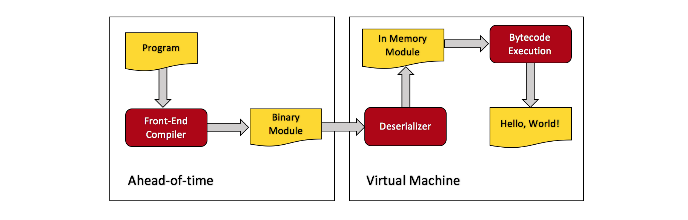
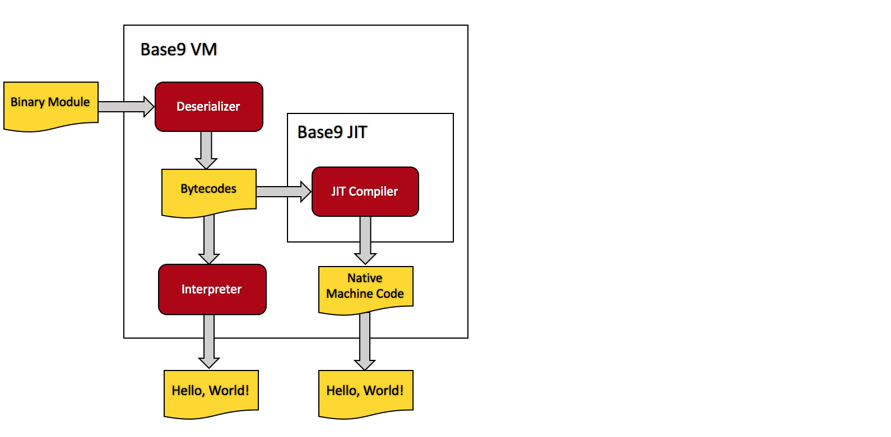

* Table of Contents
{:toc}


## Introduction

Welcome to the tutorial! If you're interested in building your own [language runtime], you've come to the right place. Base9 is a miniature language runtime, and thanks to OMR and JitBuilder, it even has a [Just In Time (JIT) Compiler]! The goal of this tutorial is not to teach you how to build base9, but rather to pack your arsenal full of tools to build your own language runtime. We don't want to bog you down with a bunch of unnecessary information, so we'll keep things very straightfoward, providing useful links/definitions along the way for you to peruse optionally and at your own convenience. If you'd like to get familiar with some of the vocabulary you'll encounter, feel free to visit the [tutorial dictionary].

[language runtime]: ./Dictionary.md#language-runtime
[Just In Time (JIT) Compiler]: ./Dictionary.md#jit-compiler
[tutorial dictionary]: ./Dictionary.md


### Get Setup

Before getting started, you should get yourself setup with Base9. You'll be using it throughout the tutorial to get familiar with language runtime concepts. Check out our [set-up page] for set-up instructions. 
[set-up page]: ./SetupBase9.md

At this point it is assumed that you have base9 installed. Let's get started!


### A Brief Overview of Base 9

Base9 has several major components that we'll discuss throughout the course of this tutorial. We'll try to provide insight about why we made the design decisions that we did, and how we built up the pieces. We encourage you to remember that much of our implementation is made up of design decisions suited to our project. Along the way, you may wish to deviate from these decisions in order to best suit your own project.

<figure class="image">
  <figcaption>Base9 Overview</figcaption>
  
</figure>

The Base9 Overview Diagram depicts the Ahead-of-Time compilation unit and the [Virtual Machine] unit. The Ahead-of-Time unit runs the b9porcelain source code through our frontend compiler. The frontend compiler outputs a binary module. The binary module is passed to the deserializer, which converts it to a c++ data structure that we've named "Module", and which will henceforth be refered to as the "in memory Module".

[Virtual Machine]: ./Dictionary.md#virtual-machine

The Virtual Machine unit is comprised of the [Interpreter] and the [JIT] (not depicted here). The in memory Module is passed to the VM, which runs the [bytecodes] of the program.

[Interpreter]: ./Dictionary.md#interpreter
[JIT]: ./Dictionary.md#jit-compiler
[bytecodes]: ./Dictionary.md#bytecode

We'll discuss each of the above components in detail in the upcoming sections. 


### Our Frontend Language

Our front-end language is a subset of JavaScript. Let's have a look at some code:
 
 ```js
 function fib(a) {
    if (a < 3) {
        return 1;
    } else {
        return fib(a - 1) + fib(a - 2);
    }
}

function b9main() {
    b9PrintString("");
    b9PrintString("Fibonacci");
    var a = 1;
    while (a <= 20) {
        b9PrintNumber(fib(a));
        a++;
    }
}
```

Above is a classic program that we all know and love, Fibonacci. `b9main()` is using two of the base9 [primitive functions] (from our primitive function table), `b9PrintString` and `b9PrintNumber`, to print to console. Currently, base9 is only capable of operating on integers. It can output strings, but it can't (yet) perform operations on them.

[primitive functions]: ./Dictionary.md#primitive-function

The frontend source code is passed as input into the [frontend compiler], which uses [Esprima] to convert the program into an [Abstract Syntax Tree] (or AST). The frontend compiler walks the AST and converts it into a portable binary format. The portable binary format is represented as a [Binary Module].

[frontend compiler]: https://github.com/b9org/b9/blob/master/js_compiler/compile.js
[Esprima]: http://esprima.org
[Abstract Syntax Tree]: https://en.wikipedia.org/wiki/Abstract_syntax_tree
[Binary Module]: ./Dictionary.md#binary-module

For a detailed overview of how we've designed/built our front-end compiler and binary format, visit the link below:

[Frontend Compiler and Binary Format](./FrontendAndBinaryMod.md)


## From Source to Bytecodes


### The Base9 Deserializer

The base9 [deserializer] at [b9/src/deserialize.cpp] is responsible for taking the binary module (as output by the frontend compiler), and converting it into the in memory Module (which contains the base9 bytecodes) to be run by the VM. 

[deserializer]: ./Dictionary.md#deserializer
[b9/src/deserialize.cpp]: https://github.com/b9org/b9/blob/master/b9/src/deserialize.cpp

The deserializer is used in base9 in two different ways. Firstly, it is used by the VM to convert a binary module to an in memory Module, as described above. Secondly, it is used by the disassembler at [b9/b9disassemble/b9disassemble.cpp]. The disassembler employs the base9 deserializer to convert a binary module into a human readable interpretation. It is primarily used as a debugging tool. Click the link below to learn more about our base9 disassembler:

[b9/b9disassemble/b9disassemble.cpp]: https://github.com/b9org/b9/blob/master/b9disassemble/b9disassemble.cpp
[Base9 Disassembler](./Disassembler.md)

Let's run it! But before we can run do that, we need a binary module to give to it. Let's convert a simple Hello, World! program to its binary format. The JavaScript source code for Hello, World! can be found in [test/hello.src], and appears as follows:

[test/hello.src]: https://github.com/b9org/b9/blob/master/test/hello.src

```
function b9main() {
    b9PrintString("Hello World!");
}
```

To run Hello, World! through the frontend compiler, use the following command from the base9 root directory: 

`node js_compiler/compile.js test/hello.src hello.b9mod`

This will run the JavaScript compiler on `test/hello.src` and output a binary module with the name `hello.b9mod`. If you run the above command, you should see `hello.b9mod` in the base9 root directory. Now let's navigate to the `build/` directory and run the disassembler with the following command:

`b9disassemble/b9disassemble ../hello.b9mod`

You should now be looking at a human readable version of the Hello, World! program as represented by its bytecodes:

```
(function "b9PrintString" 1 0
  0  (push_from_var 0)
  1  (primitive_call 0)
  2  (drop)
  3  (int_push_constant 0)
  4  (function_return)
  5  (end_section))

(function "b9PrintNumber" 1 0
  0  (push_from_var 0)
  1  (primitive_call 1)
  2  (drop)
  3  (int_push_constant 0)
  4  (function_return)
  5  (end_section))

(function "b9PrintStack" 1 0
  0  (push_from_var 0)
  1  (primitive_call 2)
  2  (drop)
  3  (int_push_constant 0)
  4  (function_return)
  5  (end_section))

(function "b9main" 0 0
  0  (str_push_constant 0)
  1  (function_call 0)
  2  (drop)
  3  (int_push_constant 0)
  4  (function_return)
  5  (end_section))

(string "Hello World!")
```

The first three functions are the base9 primitives. We can ignore those for now. The main thing to note is the conversion between the JavaScript and the bytecodes:

<figure class="image">
  
</figure>


### The Base9 Bytecode Design

Having seen how the JavaScript is converted to bytecodes, let's explore the base9 bytecode design. The base9 instruction set is stack oriented, which allows for straight-forward compilation and simple VM implementation. Let's discuss some advantages of a stack-based instruction set over a register-based model. Firstly, a stack-based instruction set allows for smaller individual instructions. Secondly, it does not require a register immediate. One disadvantage is that the total number of instructions is larger. Since all instructions oeprate on the stack, the stack can be thought of as the VM's memory. 

All of the base9 bytecodes are fixed-width. This puts constraints on what we can encode in the instructions, but it simplifies instruction decoding and jumps. 

One final thing to mention is that the base9 instruction set is untyped. This means that the bytecodes can operate on values of varying types. The way this works is by popping the operands off the stack, checking their types, and doing the operation once the type is known.  

The base9 bytecodes are defined in [b9/include/b9/instructions.hpp].

[b9/include/b9/instructions.hpp]: https://github.com/b9org/b9/blob/master/b9/include/b9/instructions.hpp

Let's take at what happens with the stack during a simple addition function:

```js
function simple_add() {
  return 5 + 6;
} 
```

The diagrams below display the bytecodes generated from the above "simple_add()" function. `IP` represents the Instruction Pointer, and `SP` represents the Stack Pointer.


<figure class="image">
  <figcaption>Push 5 onto the stack</figcaption>
  
</figure>

<figure class="image">
  <figcaption>Push 6 onto the stack</figcaption>
  
</figure>

<figure class="image">
  <figcaption>Pop last two values from the stack, add, push result</figcaption>
  
</figure>

<figure class="image">
  <figcaption>Pop and return the result</figcaption>
  
</figure>


## The Virtual Machine

### Run the VM

Now that we've seen how the bytecodes are interpreted, let's run the VM with our binary module with the Hello, World! binary module that we generated earlier. From the `build/` directory, run the following command: 

`b9run/b9run ../hello.b9mod`

You should see the following output:

```
Hello World!

=> (integer 0)
```

The "`=> (integer 0)`" is the return code of the program.


### VM Design

<figure class="image">
  
</figure>

The above diagram shows our Virtual Machine Design in greater detail. The VM takes the binary module (as produced by the frontend compiler) and converts it to a C++ data structure (that we're calling the in memory Module) containing the bytecodes. This conversion is done by the deserializer. After the conversion, the VM will employ either the Interpreter or the JIT to run the program. The Interpreter processes the bytecodes directly and one at a time. The JIT compiler converts the bytecodes to native machine code and returns a pointer to the start of the code. Once a program is JIT compiled, the bytecodes are no longer interpreted one at a time, but rather they are run in their JIT compiled version. Currently, we employ user flags to tell the VM to JIT compile an entire program and to interpret nothing. We'll leave the JIT for now and focus on the interpreter. 


## The Base9 Interpreter


======================================================


We now know how the in memory Module is created from our b9porcelain source code. Lets take a look at how we represent the Module in base9:

```c++
struct Module {
  std::vector<FunctionDef> functions;
  std::vector<std::string> strings;

  std::size_t getFunctionIndex(const std::string& name) const {
    for (std::size_t i = 0; i < functions.size(); i++) {
      if (functions[i].name == name) {
        return i;
      }
    }
    throw FunctionNotFoundException{name};
  }
};
```

The Module contains only 2 fields; a `functions` vector, and a `strings` vector. `functions` contains a set of function definitions, or `FunctionDef`'s. More on that in a moment. The strings vector in the Module contain the contents of the string table, which holds any strings used by the b9porcelain program. Lastly in the Module, we see a function called `getFunctionIndex`, which traverses the functions vector using a function name, and returns that functions position in the vector. 

Now let's take a look at our `FunctionDef` struct: 

```c++
struct FunctionDef {
  // Copy Constructor
  FunctionDef(const std::string& name, std::uint32_t index,
              const std::vector<Instruction>& instructions,
              std::uint32_t nargs = 0, std::uint32_t nregs = 0)
      : name{name},
        index{index},
        instructions{instructions},
        nargs{nargs},
        nregs{nregs} {}

  // Move Constructor
  FunctionDef(const std::string& name, std::uint32_t index,
              std::vector<Instruction>&& instructions, std::uint32_t nargs = 0,
              std::uint32_t nregs = 0)
      : name{name},
        index{index},
        instructions{std::move(instructions)},
        nargs{nargs},
        nregs{nregs} {}

  // Function Data
  std::string name;
  uint32_t index;
  std::uint32_t nargs;
  std::uint32_t nregs;
  std::vector<Instruction> instructions;
};
```

The fields of the `FunctionDef` are the name of the function, the index of the function in the function vector, the number of arguments, the number of registers, and the `Instructions` vector (which contains the bytecodes). 

The bytecodes are made up of 32-bit instructions which encode both the instruction bytecode and the immediate parameter. The instruction layout is as follows:

```
|0000-0000 0000-0000 0000-0000 0000-0000
|---------| bytecode (8 bits)
          |-----------------------------| parameter (24 bits)
```

Note that for many ByteCodes, the parameter is unused and left as zero.


### 1.4 Execution Model

The base9 Virtual Machine is a relatively simple c++ class which can be found in [b9/include/b9/VirtualMachine.hpp]. It is instantiated in [b9run/main.cpp] in the `run` function, where it deserializes a binary module which has been compiled from b9porcelain source code, loads the resulting in memory Module, and runs the program. The Module is created by converting a sequence of bits which are represented as per our [binary format]. The binary format is then deserialized to create the in memory Module containing the bytecodes to be run. The VM then has two ways of handling the Module. It can either execute the Module's bytecodes line by line in the interpreter, or it can choose to JIT compile the bytecodes and run that version instead. 

[b9/include/b9/VirtualMachine.hpp]: https://github.com/b9org/b9/blob/master/b9/include/b9/VirtualMachine.hpp
[b9run/main.cpp]: https://github.com/b9org/b9/blob/master/b9run/main.cpp
[binary format]: ./FrontendAndBinaryMod.md#binary-format

<figure class="image">
  <figcaption>b9porcelain to Bytecodes</figcaption>
  
</figure>

The above diagram shows a direct translation between b9porcelain source code and it's corresponding bytecodes.

<figure class="image">
  <figcaption>Virtual Machine Design</figcaption>
  
</figure>

The above diagram shows our Virtual Machine Design. The VM takes the binary module and converts it to bytecodes using the deserializer. The bytecodes are stored in the in memory Module. Then, the VM will employ either the Interpreter or the JIT to run the program. The Interpreter processes the bytecodes directly and one at a time. The JIT compiler converts the bytecodes to native machine code and returns a pointer to the start of the code. Once a program is JIT compiled, the bytecodes are no longer interpreted one at a time, but rather they are run in their JIT compiled version. Currently, we employ user flags to tell the VM to JIT compile an entire program and to interpret nothing. To run a fully JIT compiled program, navigate to the `build/` directory and run:

`./b9run/b9run -jit ./test/<binary module>.b9mod`

Eventually, we will add profiling to base9, which will allow the VM to record statistics about the program and to make decisions about which individual functions to JIT compile.

### 1.5 The Virtual Machine

The base9 VM has been subject to many design decisions. Please note, as with many of our components, there are multiple ways to implement a language runtime. As discussed above, the base9 virtual machine takes a Module structure as input. Let's take a look at our [main function] to gain a better understanding of how this works. Our main function calls `run(runtime, cfg);` which is as follows:

[main function]: https://github.com/b9org/b9/blob/master/b9run/main.cpp

```
static void run(OMR::Om::ProcessRuntime& runtime, const RunConfig& cfg) {
  b9::VirtualMachine vm{runtime, cfg.b9};

  std::ifstream file(cfg.moduleName, std::ios_base::in | std::ios_base::binary);
  auto module = b9::deserialize(file);
  vm.load(module);

  if (cfg.b9.jit) {
    vm.generateAllCode();
  }

  size_t functionIndex = module->getFunctionIndex(cfg.mainFunction);
  for (std::size_t i = 0; i < cfg.loopCount; i += 1) {
    auto result = vm.run(functionIndex, cfg.usrArgs);
    std::cout << std::endl << "=> " << result << std::endl;
  }
}
```

Walking through the code, we can see the VM being instantiated using a ProcessRuntime from OMR which we will use if JIT compiling our program, and a RunConfig containing some basic information about the Module which we obtained from parsing the command line arguments when we launched the VM. Next we obtain our binary module and deserialize the data. The information from the binary module is stored in the in memory Module. The VM then loads the in memory Module. Next, it checks if the user has specified to JIT compile the program. If yes, the bytecodes are JIT compiled using the `generateCode` function. If no, the VM obtains the main function of the program and begins interpreting. 

As you may have noticed, much of the information used in the `run` function was obtained via command line arguments provided by the user. It is therefore reasonable that one of your first major considerations will be how the user interacts with your runtime. In base9, we compile b9porcelain into a binary module using the following command:

`node ./compile.js <in> <out>`

Where `<in>` is the b9porcelain source program, and `<out>` is the name to give to our binary module. Once a binary module is generated, we can run the VM.

To run the VM, we do the following:

`b9run [<option>...] [--] <module> [<arg>...]`

The `[<option>...]` parameters can be found in [b9run/main.cpp] and are as follows:

```    
Help Option:
   -help          Prints usage and options

Jit Options:
   -jit:          Enable the jit
   -directcall:   make direct jit to jit calls
   -passparam:    Pass arguments in CPU registers
   -lazyvmstate:  Only update the VM state as needed

Run Options:
   -function <f>: Run the function <f> (default: b9main)
   -loop <n>:     Run the program <n> times (default: 1)
   -inline <n>:   Set the jit's max inline depth (default: 0)
   -debug:        Enable debug code
   -verbose:      Run with verbose printing
   -help:         Print this help message
```


Moving past the options, the `<module>` argument is the binary module to be deserialized, which we created using `compile.js`. It will have whichever name you provided as the `<out> argument. If you take a look in [main.cpp], you'll notice our argument parsing function, which collects the `<module>` argument from the command line. If you choose to run your VM from the command line, you will need to do something similar. 

[b9run/main.cpp]: https://github.com/b9org/b9/blob/master/b9run/main.cpp

Again, how we structure and handle our binary format was a personal design decision that may or may not work for your runtime. We chose to convert our binary file into the in memory Module, and to load it into the VM to run. Lets take a closer look at how the VM runs our Module. 

### 1.6 The Interpreter

Once the VM is instantiated and has loaded the Module, it calls the `VirtualMachine::run` function in [b9/src/core.cpp], which in turn calls the interpreter. The interpreter can be found in [b9/src/ExecutionContext.cpp] in the `interpret` function (`StackElement ExecutionContext::interpret(const std::size_t functionIndex)`). The `interpret` function contains a while loop wrapped around a switch statement. The while loop iterates the bytecodes in a given function and executes the appropriate code for each particular bytecode it encounters. 

[b9/src/core.cpp]: https://github.com/b9org/b9/blob/master/b9/src/core.cpp
[b9/src/ExecutionContext.cpp]: https://github.com/b9org/b9/blob/master/b9/src/ExecutionContext.cpp


### 1.7 Base9 Summary

To conclude this section, let's briefly walk over the components we've covered thus far. `b9porcelain` is our front-end language. It is compiled by our [frontend compiler] using Esprima, and converted into our binary module. The binary module is fed to our deserializer in [b9/src/deserialize.cpp], which converts it into the in memory Module to be consumed by the VM. The VM is itself a c++ class, and can be found in [b9/include/b9/VirtualMachine.hpp]. Once instantiated, the VM loads and runs the Module through the interpreter in [b9/src/ExecutionContext.cpp]. 

[frontend compiler]: https://github.com/b9org/b9/blob/master/js_compiler/compile.js
[b9/src/deserialize.cpp]: https://github.com/b9org/b9/blob/master/b9/src/deserialize.cpp
[b9/include/b9/VirtualMachine.hpp]: https://github.com/b9org/b9/blob/master/b9/include/b9/VirtualMachine.hpp
[b9/src/ExecutionContext.cpp]: https://github.com/b9org/b9/blob/master/b9/src/ExecutionContext.cpp


## 2.0 Plugging in the JIT Compiler 

As we mentioned earlier, our JIT compiler is made possible by [OMR] and [JitBuilder]. We keep OMR in our [third_party] directory as a [submodule]. JitBuilder exists as part of OMR.

[OMR]: https://eclipse.org/omr/
[JitBuilder]: https://developer.ibm.com/open/2016/07/19/jitbuilder-library-and-eclipse-omr-just-in-time-compilers-made-easy/
[third_party]: https://github.com/b9org/b9/tree/master/third_party
[submodule]: ./Dictionary.md#submodule

With our OMR submodule, and with the correct `#include`'s in our base9 headers, using OMR and JitBuilder functionality is easy!  


### 2.1 The Base9 Compiler

Let's start by taking a look at [b9/src/Compiler.hpp], where we define our `Compiler` class. 

[b9/src/Compiler.hpp]: https://github.com/b9org/b9/blob/master/b9/include/b9/compiler/Compiler.hpp

The `Compiler` class constructor takes a `VirtualMachine` class (above in section 1.5), and a `Config` struct. It is called as follows: 

`Compiler(VirtualMachine &virtualMachine, const Config &cfg);`

The `Config` struct is in [b9/include/b9/VirtualMachine.hpp] and is defined as follows:

[b9/include/b9/VirtualMachine.hpp]: https://github.com/b9org/b9/blob/master/b9/include/b9/VirtualMachine.hpp

```
struct Config {
  std::size_t maxInlineDepth = 0;  //< The JIT's max inline depth
  bool jit = false;                //< Enable the JIT
  bool directCall = false;         //< Enable direct JIT to JIT calls
  bool passParam = false;          //< Pass arguments in CPU registers
  bool lazyVmState = false;        //< Simulate the VM state
  bool debug = false;              //< Enable debug code
  bool verbose = false;            //< Enable verbose printing and tracing
};
```

We use the `Config` class to configure the JIT with a number of settings. Note that `directCall`, `passParam`, and `lazyVmState` are all JIT optimizations that we'll discuss later. The rest of the values are explained in the comments. 

Let's have a look at the `Compiler` class:

```
class Compiler {
 public:
  Compiler(VirtualMachine &virtualMachine, const Config &cfg);
  JitFunction generateCode(const std::size_t functionIndex);

  const GlobalTypes &globalTypes() const { return globalTypes_; }

  TR::TypeDictionary &typeDictionary() { return typeDictionary_; }

  const TR::TypeDictionary &typeDictionary() const { return typeDictionary_; }

 private:
  TR::TypeDictionary typeDictionary_;
  const GlobalTypes globalTypes_;
  VirtualMachine &virtualMachine_;
  const Config &cfg_;
};
```

`TR::TypeDictionary` allows us to define which types are supported by our b9porcelain language. It's used by the `MethodBuilder` class in OMR JitBuilder. We define our supported types in [b9/include/b9/compiler/GlobalTypes.hpp].

[b9/include/b9/compiler/GlobalTypes.hpp]: https://github.com/b9org/b9/blob/master/b9/include/b9/compiler/GlobalTypes.hpp

```c++
/// A collection of basic, built in types.
class GlobalTypes {
 public:
  GlobalTypes(TR::TypeDictionary &td);

  TR::IlType *addressPtr;
  TR::IlType *int64Ptr;
  TR::IlType *int32Ptr;
  TR::IlType *int16Ptr;

  TR::IlType *stackElement;
  TR::IlType *stackElementPtr;
  TR::IlType *instruction;
  TR::IlType *instructionPtr;

  TR::IlType *operandStack;
  TR::IlType *operandStackPtr;
  TR::IlType *executionContext;
  TR::IlType *executionContextPtr;
};
```

We use the `TR::TypeDictionary` to define our `GlobalTypes`, as shown above. 

Now let's have a look in [b9/src/Compiler.cpp] at the `Compiler::generateCode` function:

[b9/src/Compiler.cpp]: https://github.com/b9org/b9/blob/master/b9/src/Compiler.cpp

```c++
JitFunction Compiler::generateCode(const std::size_t functionIndex) {
  const FunctionDef *function = virtualMachine_.getFunction(functionIndex);
  MethodBuilder methodBuilder(virtualMachine_, functionIndex);

  if (cfg_.debug)
    std::cout << "MethodBuilder for function: " << function->name
              << " is constructed" << std::endl;

  uint8_t *result = nullptr;
  auto rc = compileMethodBuilder(&methodBuilder, &result);

  if (rc != 0) {
    std::cout << "Failed to compile function: " << function->name
              << " nargs: " << function->nargs << std::endl;
    throw b9::CompilationException{"IL generation failed"};
  }

  if (cfg_.debug)
    std::cout << "Compilation completed with return code: " << rc
              << ", code address: " << static_cast<void *>(result) << std::endl;

  return (JitFunction)result;
}
```

The `generateCode` function takes a `functionIndex` as it's only parameter. First we need to access the current function using `virtualMachine_.getFunction(functionIndex)`. `getFunction()` is in the `VirtualMachine` class, and it uses the function index to access a given `FunctionDef` in the Module's function vector. We store it's return value in the function pointer `*function`. 

The checks `if(cfg_.debug)` are found throughout our codebase, and we use them to check if we're running the VM in debug mode. If we are, we provide additional output. It's a useful debugging strategy that you may or may not choose to employ. 

The `rc` value is set to 0 and should remain as 0 through the `compileMethodBuilder` call. If it does not remain 0, something has gone wrong. 

Our return value is simply a pointer to a uint8_t, which serves as the entry point into our Jitted function. 

`generateCode` is currently only called by the VM function `generateAllCode`,  because thus far we've only implemented the ability to JIT compile either everything or nothing. We run our program using the JIT with the following command: 

`./b9run/b9run -jit ./test/<program>.b9mod`


### 2.2 JIT Features

Currently, we've implemented 3 JIT optimizations. Direct call, Pass Param, and Lazy VM State. 

Direct call allows us to check whether or not the function we are calling has been JIT compiled, and then jump directly to the JITed function, bypassing the interpreter.

Pass Param allows JIT compiled methods calling other JIT compiled methods to pass their parameters using C native calling conventions. 
Lazy VM State simulates the interpreter stack while running in a compiled method and restores the interpreter stack when returning into the interpreter. 

Because of our current all-or-nothing state, if one method is JIT compiled, they all are, and using the above optimizations will improve performance significantly. To run the JIT with the above optimizations, do:

`./b9run/b9run -jit -directcall -passparam -lazyvmstate ./test/<program>.b9mod`


