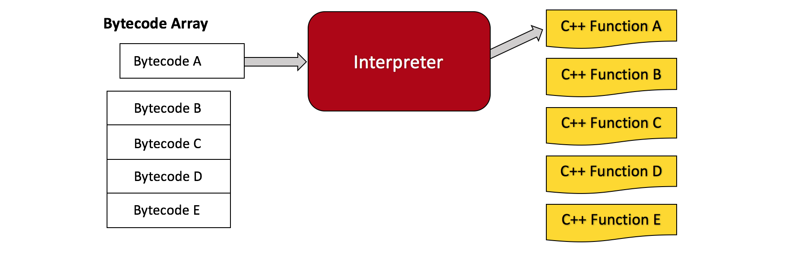

* Table of Contents
{:toc}

```

```

## Introduction

Welcome to the tutorial! If you're interested in building your own [language runtime], you've come to the right place. Base9 is a miniature language runtime, and thanks to OMR and JitBuilder, it even has a [Just In Time (JIT) Compiler]! The goal of this tutorial is not to teach you how to build base9, but rather to pack your arsenal full of tools to build your own language runtime. We don't want to bog you down with a bunch of unnecessary information, so we'll keep things very straightfoward, providing useful links/definitions along the way for you to peruse optionally and at your own convenience. If you'd like to get familiar with some of the vocabulary you'll encounter, feel free to visit the [tutorial dictionary].

[language runtime]: ./Dictionary.md#language-runtime
[Just In Time (JIT) Compiler]: ./Dictionary.md#jit-compiler
[tutorial dictionary]: ./Dictionary.md


### Base9 Setup

Before getting started, you should get yourself setup with Base9. You'll be using it throughout the tutorial to get familiar with language runtime concepts. Check out our [set-up page] for set-up instructions. 
[set-up page]: ./SetupBase9.md

At this point it is assumed that you have base9 installed. Let's get started!


### Base9 Overview

Base9 has several major components that we'll discuss throughout the course of this tutorial. We'll try to provide insight about why we made the design decisions that we did, and how we built up the pieces. We encourage you to remember that much of our implementation is made up of design decisions suited to our project. Along the way, you may wish to deviate from these decisions in order to best suit your own project.

<figure class="image">
  <figcaption>Base9 Overview</figcaption>
  
</figure>

The Base9 Overview Diagram depicts the Ahead-of-Time compilation unit and the [Virtual Machine] unit. Base9 uses a primitive subset of JavaScript as its frontend language. The Ahead-of-Time unit runs the JavaScript source code through our frontend compiler. The frontend compiler outputs a binary module. The binary module is passed to the deserializer, which converts it to a C++ data structure that we've named "Module", and which will henceforth be refered to as the "in memory Module".

[Virtual Machine]: ./Dictionary.md#virtual-machine

The Virtual Machine unit is comprised of the [Interpreter] and the [JIT]. The in memory Module is passed to the VM, which runs the [bytecodes] of the program.

[Interpreter]: ./Dictionary.md#interpreter
[JIT]: ./Dictionary.md#jit-compiler
[bytecodes]: ./Dictionary.md#bytecode

We'll discuss each of the above components in detail in the upcoming sections. 

```

```
<center> *** </center>
```

```


## The Base9 Frontend

### Frontend Language

Our front-end language is a subset of JavaScript. Let's have a look at some code:
 
 ```js
function b9main() {
  b9PrintString("Hello World!");
}
```

Above is a classic program that we all know and love, Hello, World!. It can be found in [test/hello.src]. `b9main()` is using one of the three base9 [primitive functions] (from our primitive function library in [b9/js_compiler/b9stdlib.src]). Hello, World! is using `b9PrintString` to print to console. Currently, base9 is only capable of operating on integers. It can output strings, but it can't (yet) perform operations on them.

[test/hello.src]: https://github.com/b9org/b9/blob/master/test/hello.src
[primitive functions]: ./Dictionary.md#primitive-function
[b9/js_compiler/b9stdlib.src]: https://github.com/b9org/b9/blob/master/js_compiler/b9stdlib.src


### Frontend Compiler

The frontend source code is passed as input into the [frontend compiler], which uses [Esprima] to convert the program into an [Abstract Syntax Tree] (or AST). The frontend compiler walks the AST and converts it into a portable binary format. The portable binary format is represented as a [Binary Module].

[frontend compiler]: https://github.com/b9org/b9/blob/master/js_compiler/compile.js
[Esprima]: http://esprima.org
[Abstract Syntax Tree]: https://en.wikipedia.org/wiki/Abstract_syntax_tree
[Binary Module]: ./Dictionary.md#binary-module

For a detailed overview of how we've designed/built our front-end compiler and binary format, visit the link below:

[Frontend Compiler and Binary Format](./FrontendAndBinaryMod.md)

Let’s convert the Hello, World! program to its binary format by running it through the frontend compiler. Making sure you're in the root directory, run:

`node js_compiler/compile.js test/hello.src hello.b9mod`

The above command will run the JavaScript compiler on `test/hello.src` and output a binary module with the name `hello.b9mod`. If you run the above command, you should see `hello.b9mod` in the base9 root directory.

```

```
<center> *** </center>

```

```


## The Base9 Backend

### The Deserializer

The base9 [deserializer] at [b9/src/deserialize.cpp] is responsible for taking the binary module (as output by the frontend compiler), and converting it into the in memory Module (which contains the base9 bytecodes) to be run by the VM. 

[deserializer]: ./Dictionary.md#deserializer
[b9/src/deserialize.cpp]: https://github.com/b9org/b9/blob/master/b9/src/deserialize.cpp

The deserializer is used in base9 in two different ways. Firstly, it is used by the VM to convert a binary module to an in memory Module, as described above. Secondly, it is used by the disassembler at [b9/b9disassemble/b9disassemble.cpp]. The disassembler employs the base9 deserializer to convert a binary module into a human readable interpretation. It is primarily used as a debugging tool. Click the link below to learn more:

[b9/b9disassemble/b9disassemble.cpp]: https://github.com/b9org/b9/blob/master/b9disassemble/b9disassemble.cpp
[Base9 Disassembler](./Disassembler.md)

Let's run the disassembler using the binary module we just generated! Navigate to the build directory and run the following command:

`b9disassemble/b9disassemble ../hello.b9mod`

You should now be looking at a human readable version of the Hello, World! program as represented by its bytecodes:

```
(function "b9PrintString" 1 0
  0  (push_from_var 0)
  1  (primitive_call 0)
  2  (drop)
  3  (int_push_constant 0)
  4  (function_return)
  5  (end_section))

(function "b9PrintNumber" 1 0
  0  (push_from_var 0)
  1  (primitive_call 1)
  2  (drop)
  3  (int_push_constant 0)
  4  (function_return)
  5  (end_section))

(function "b9PrintStack" 1 0
  0  (push_from_var 0)
  1  (primitive_call 2)
  2  (drop)
  3  (int_push_constant 0)
  4  (function_return)
  5  (end_section))

(function "b9main" 0 0
  0  (str_push_constant 0)
  1  (function_call 0)
  2  (drop)
  3  (int_push_constant 0)
  4  (function_return)
  5  (end_section))

(string "Hello World!")
```

The first three functions are the base9 primitives that we mentioned earlier. Let's take a look at the direct conversion between the JavaScript and the bytecodes:

<figure class="image">
  
</figure>

Stepping through the bytecodes, we start with a `str_push_constant`, which pushes the string "Hello, World!" onto the stack. Next is `function_call`, which does the call to `b9PrintString`. The `drop` bytecode drops the top value from the stack, and is being used to remove the unused return value of the `b9PrintString` function. `int_push_constant` is pushing 0 onto the stack as the return value of `b9main`. `function_return` is doing the actual return, and `end_section` is the end-of-bytecodes marker, which is essentially just a safety feature should the interpreter continue running after the return.


### The Base9 Bytecodes

Now that we've seen how the JavaScript is converted to bytecodes, let's explore the base9 bytecode design. 

The base9 instruction set is stack oriented, which allows for straight-forward compilation and simple VM implementation.  Stack-based instruction sets have a couple of advantages  over the register-based model. Firstly, stack-based instructions are smaller. They also don't require a register immediate. One disadvantage is that the total number of instructions is larger. Since all instructions oeprate on the stack, the stack can be thought of as the VM's memory. 

All of the base9 bytecodes are fixed-width. This puts constraints on what we can encode in the instructions, but it simplifies instruction decoding and jumps. Below is the layout of a single base9 instruction:

```
|0000-0000 0000-0000 0000-0000 0000-0000
|---------| bytecode (8 bits)
          |-----------------------------| parameter (24 bits)
```

Note that for many base9 bytecodes, the parameter is unused and left as zero.

One final thing to mention is that the base9 instruction set is untyped. This means that the bytecodes can operate on values of varying types. The way this works is by popping the operands off the stack, checking their types, and doing the correct operation once the type is known.  

All base9 bytecodes are defined in [b9/include/b9/instructions.hpp].

[b9/include/b9/instructions.hpp]: https://github.com/b9org/b9/blob/master/b9/include/b9/instructions.hpp


### The Stack

As recently mentioned, the base9 bytecodes are stack oriented. Let's take at what happens with the stack during a simple addition function:

```js
function simple_add() {
  return 5 + 6;
} 
```

The following diagrams display the bytecodes generated from the above "simple_add()" function. 

**IP** = Instruction Pointer

**SP** = Stack Pointer

<figure class="image">
  <figcaption>PUSH 5 ONTO THE STACK</figcaption>
  
</figure>

<figure class="image">
  <figcaption>PUSH 6 ONTO THE STACK</figcaption>
  
</figure>

<figure class="image">
  <figcaption>POP TOP TWO VALUES, ADD, PUSH RESULT</figcaption>
  
</figure>

<figure class="image">
  <figcaption>POP AND RETURN RESULT</figcaption>
  
</figure>


### The Virtual Machine

Now that we've learned a bit about the bytecodes, let's run the VM with the Hello, World! binary module that we generated earlier. From the `build/` directory, run the following command: 

`b9run/b9run ../hello.b9mod`

You should see the following output:

```
Hello World!

=> (integer 0)
```

The "`=> (integer 0)`" is the return code of the program. It will be 0 unless something has gone wrong during execution.

<figure class="image">
  <figcaption>VM Design</figcaption>
  
</figure>

The above diagram shows the components of the Virtual Machine Design in greater detail. The VM takes the binary module (as produced by the frontend compiler) and converts it to a C++ data structure (that we're calling the in memory Module) containing the bytecodes. This conversion is done by the deserializer. After the conversion, the VM will employ either the Interpreter or the JIT to run the program. The Interpreter processes the bytecodes directly and one at a time. The JIT compiler converts the bytecodes to native machine code and returns a pointer to the start of the code. Once a program is JIT compiled, the bytecodes are no longer interpreted one at a time, but rather they are run in their JIT compiled version. Currently, we employ user flags to tell the VM to JIT compile an entire program and to interpret nothing. We'll leave the JIT for now and focus on the interpreter. 


### The Interpreter

The interpreter's job is to take a sequence of bytecodes and match each of them with a corresponding C++ function. The relationship between bytecodes and corresponding C++ functions is one-to-one. Earlier, when we ran our Hello, World! program, it ran by default on the interpreter. The VM will always run the interpreter by default. The base9 interpreter is very simple, consisting of a while-loop and switch statement to iterate a sequence of bytecodes. 

<figure class="image">
  <figcaption>The Interpreter</figcaption>
  
</figure>

The interpreter is implemented in [b9/src/ExecutionContext.cpp]. Let's take a look at the code:

[b9/src/ExecutionContext.cpp]: https://github.com/b9org/b9/blob/master/b9/src/ExecutionContext.cpp

```c++
StackElement ExecutionContext::interpret(const std::size_t functionIndex) {
  auto function = virtualMachine_->getFunction(functionIndex);
  auto argsCount = function->nargs;
  auto jitFunction = virtualMachine_->getJitAddress(functionIndex);

  if (jitFunction) {
    return callJitFunction(jitFunction, argsCount);
  }

  // interpret the method otherwise
  const Instruction *instructionPointer = function->instructions.data();

  StackElement *args = stack_.top() - function->nargs;
  stack_.pushn(function->nregs);

  ...

```

This first bit of the `interpret` function deals with some initial setup. The single parameter is `functionIndex`, which we use to get the individual function we wish to interpret. The interpreter then checks if the particular function has previously been JIT compiled. If it has, we use that function instead, and return from the interpreter. If it hasn't, the `instructionPointer is initialized to the start of the instruction sequence, the arguments are collected from the top of the stack, and storage for local variables is allocated on the stack. 

Now let's take a look at the while-loop and switch-statement.

```c++
  while (*instructionPointer != END_SECTION) {
    switch (instructionPointer->byteCode()) {
      
      ...

      case ByteCode::FUNCTION_RETURN: {
        auto result = stack_.pop();
        stack_.restore(args);
        return result;
        break;
      }
      
      ...
      
      case ByteCode::INT_ADD:
        doIntAdd();
        break;
     
     ...

```

We've excluded much of the interpreter loop for simplicity, but we'll discuss a couple of the cases to give you an idea of how it works. Above we have the `FUNCTION_RETURN` bytecode case and the `INT_ADD` bytecode case. In the `FUNCTION_RETURN` case, the top of the stack (which is storing the return value of the function) is popped and stored in the `result` variable. The stack is then restored and the return value is returned. This is the only bytecode in the interpreter loop that returns a value, which makes sense, because this bytecode is only reached at the end of a function when there are no more bytecodes to process. The `INT_ADD` bytecode case calls `doIntAdd()`, which is a simple C++ function:

```c++
void ExecutionContext::doIntAdd() {
  std::int32_t right = stack_.pop().getInteger();
  std::int32_t left = stack_.pop().getInteger();
  StackElement result;
  result.setInteger(left + right);
  push(result);
}
```

In summary, the interpreter is simply a mechanism for translating the bytecodes into C++. It’s one-at-a-time bytecode processing makes it inherantly slow, which makes the JIT compiler an important part of reducing execution time. 

```

```
<center> *** </center>
```

```


## Base9 Implementation


### The `main` function

Recall the command we use to run the VM with a binary module (from the `build/` directory):

`b9run/b9run ../hello.b9mod`

The entry point for our `b9run` program can be found in [b9run/main.cpp]. Let's take a look a the `main` function: 

[b9run/main.cpp]: https://github.com/b9org/b9/blob/master/b9run/main.cpp

```c++
int main(int argc, char* argv[]) {
  OMR::Om::ProcessRuntime runtime;
  RunConfig cfg;

  if (!parseArguments(cfg, argc, argv)) {
    std::cerr << usage << std::endl;
    exit(EXIT_FAILURE);
  }

  ... 

  try {
    run(runtime, cfg);
    
  ...

  exit(EXIT_SUCCESS);
}
```

The first thing that occurs in `main` is the instatiation of a `ProcessRuntime` and a `RunConfig`. `ProcessRuntime` does a process wide initialization for the `om` libary, which provides OMR with facilities for garbage collected objects. No need to worry about it, because other than the instantiation, it takes care of itself!

`RunConfig` is a struct (inside of [b9run/main.cpp]), which sets up the base9 global configuration:

```c++
struct RunConfig {
  b9::Config b9;
  const char* moduleName = "";
  const char* mainFunction = "b9main";
  std::size_t loopCount = 1;
  bool verbose = false;
  std::vector<b9::StackElement> usrArgs;
};
```

When we ran `b9run`, we could have provided our command with a number of options. The command structure for `b9run` is as follows:

`b9run [<option>...] [--] <module> [<arg>...]`

From the build directory, run `b9run/b9run -help` for a complete listing of options.


The `RunConfig` struct begins with a default configuration, but may later be modified according to the command line options provided by the user. As you can see in the `main` function, the next thing to occur is argument parsing. This is where the `RunConfig` struct may be modified. The final thing to occur in the `main` function is a call to `run(runtime, cfg)`.


### The `run` function

Let's take a look at the `run` function:

```
static void run(OMR::Om::ProcessRuntime& runtime, const RunConfig& cfg) {
  b9::VirtualMachine vm{runtime, cfg.b9};

  std::ifstream file(cfg.moduleName, std::ios_base::in | std::ios_base::binary);
  auto module = b9::deserialize(file);
  vm.load(module);

  if (cfg.b9.jit) {
    vm.generateAllCode();
  }

  size_t functionIndex = module->getFunctionIndex(cfg.mainFunction);
  for (std::size_t i = 0; i < cfg.loopCount; i += 1) {
    auto result = vm.run(functionIndex, cfg.usrArgs);
    std::cout << std::endl << "=> " << result << std::endl;
  }
}
```

This is where the `VirtualMachine` class is instantiated. This class can be found [b9/include/b9/VirtualMachine.hpp]. The `run` function deserializes a binary module which has been compiled from JavaScript source code and loads the resulting in memory Module. Next, it checks if JIT has been turned on. If yes, the bytecodes are JIT compiled using the `generateCode` function. If no, the VM obtains the main function of the program and begins interpreting.


### The in memory `Module`

The in memory Module, as mentioned earlier, is created by deserializing a [binary module]. Let's have a look at the in memory Module:

```c++
struct Module {
  std::vector<FunctionDef> functions;
  std::vector<std::string> strings;

  std::size_t getFunctionIndex(const std::string& name) const {
    for (std::size_t i = 0; i < functions.size(); i++) {
      if (functions[i].name == name) {
        return i;
      }
    }
    throw FunctionNotFoundException{name};
  }
};
```

The Module contains only 2 fields; a `functions` vector, and a `strings` vector. `functions` contains a set of function definitions, or `FunctionDef`'s. The `strings` vector in the Module contains the contents of the string table, which holds any strings used by the JavaScript program. Lastly, there's `getFunctionIndex`, which traverses the `functions` vector using a function name, and returns that function's position in the vector. 


### The `functionDef` struct

Now let's take a look at our `FunctionDef` struct: 

```c++
struct FunctionDef {
  // Copy Constructor
  FunctionDef(const std::string& name, std::uint32_t index,
              const std::vector<Instruction>& instructions,
              std::uint32_t nargs = 0, std::uint32_t nregs = 0)
      : name{name},
        index{index},
        instructions{instructions},
        nargs{nargs},
        nregs{nregs} {}

  // Move Constructor
  FunctionDef(const std::string& name, std::uint32_t index,
              std::vector<Instruction>&& instructions, std::uint32_t nargs = 0,b9/include/b9/VirtualMachine.hpp
              std::uint32_t nregs = 0)
      : name{name},
        index{index},
        instructions{std::move(instructions)},
        nargs{nargs},
        nregs{nregs} {}

  // Function Data
  std::string name;
  uint32_t index;
  std::uint32_t nargs;
  std::uint32_t nregs;
  std::vector<Instruction> instructions;
};
```

The fields of the `FunctionDef` are the name of the function, the index of the function in the function vector, the number of arguments, the number of registers, and the `Instructions` vector (which contains the bytecodes). 


### Implementation Summary

The VM then has two ways of handling the Module. It can either execute the Module's bytecodes line by line in the interpreter, or it can choose to JIT compile the bytecodes and run that version instead. The Interpreter processes the bytecodes directly and one at a time. The JIT compiler converts the bytecodes to native machine code and returns a pointer to the start of the code. Once a program is JIT compiled, the bytecodes are no longer interpreted one at a time, but rather they are run in their JIT compiled version. Currently, we employ user flags to tell the VM to JIT compile an entire program and to interpret nothing. We aim to add profiling to base9, which will allow the VM to record statistics about the program and to make decisions about which individual functions to JIT compile.

To run the VM using just the interpreter:

`b9run/b9run <binary_module>`

To run a fully JIT compiled program:

`./b9run/b9run -jit <binary_module>`

A reminder that both of the above commands should be run from the `/build` directory.

To conclude this section, let's briefly walk over the components we've covered thus far. JavaScript is the front-end language. It is compiled using the frontend compiler and Esprima, and eventually converted into a binary module. The binary module is consumed by the deserializer in [b9/src/deserialize.cpp], which converts it into the in memory Module to be consumed by the VM. The VM is itself a C++ class, and can be found in [b9/include/b9/VirtualMachine.hpp]. Once instantiated, the VM loads and runs the Module through the interpreter in [b9/src/ExecutionContext.cpp]. 

[b9/src/deserialize.cpp]: https://github.com/b9org/b9/blob/master/b9/src/deserialize.cpp
[b9/include/b9/VirtualMachine.hpp]: https://github.com/b9org/b9/blob/master/b9/include/b9/VirtualMachine.hpp
[b9/src/ExecutionContext.cpp]: https://github.com/b9org/b9/blob/master/b9/src/ExecutionContext.cpp

```

```
<center> *** </center>
```

```


## OMR

OMR is an open source and reusable C++ library for building language runtimes. It is language-agnostic, allows incremental enablement of advanced functionality, and allows developers to bootstrap the developement of new language runtimes. 

<figure class="image">
  <figcaption>OMR Overview</figcaption>
  
</figure>

The above diagram depicts the base9 components in yellow. These are the components that a developer wishing to create a language runtime would need to implement themself. The red areas are the OMR components.

### The JIT Compiler 

As we mentioned earlier, our JIT compiler is made possible by [OMR] and [JitBuilder]. We keep OMR in our [third_party] directory as a [git submodule]. JitBuilder exists as part of OMR.

[OMR]: https://eclipse.org/omr/
[JitBuilder]: https://developer.ibm.com/open/2016/07/19/jitbuilder-library-and-eclipse-omr-just-in-time-compilers-made-easy/
[third_party]: https://github.com/b9org/b9/tree/master/third_party
[git submodule]: ./Dictionary.md#submodule

Let's run our Hello, World! program using the JIT. From the `/build` directory:

`./b9run/b9run -jit ../hello.b9mod`

With our OMR submodule, and with the correct `#include`'s in our base9 headers, using OMR and JitBuilder functionality is easy! Let's start by taking a look at [b9/src/Compiler.hpp], where we define our `Compiler` class. 

[b9/src/Compiler.hpp]: https://github.com/b9org/b9/blob/master/b9/include/b9/compiler/Compiler.hpp

The `Compiler` class constructor takes a `VirtualMachine` class (above in section 1.5), and a `Config` struct. It is called as follows: 

`Compiler(VirtualMachine &virtualMachine, const Config &cfg);`

The `Config` struct is in [b9/include/b9/VirtualMachine.hpp] and is defined as follows:

[b9/include/b9/VirtualMachine.hpp]: https://github.com/b9org/b9/blob/master/b9/include/b9/VirtualMachine.hpp

```
struct Config {
  std::size_t maxInlineDepth = 0;  //< The JIT's max inline depth
  bool jit = false;                //< Enable the JIT
  bool directCall = false;         //< Enable direct JIT to JIT calls
  bool passParam = false;          //< Pass arguments in CPU registers
  bool lazyVmState = false;        //< Simulate the VM state
  bool debug = false;              //< Enable debug code
  bool verbose = false;            //< Enable verbose printing and tracing
};
```

We use the `Config` class to configure the JIT with a number of settings. Note that `directCall`, `passParam`, and `lazyVmState` are all JIT optimizations that we'll discuss later. The rest of the values are explained in the comments. 

Let's have a look at the `Compiler` class:

```
class Compiler {
 public:
  Compiler(VirtualMachine &virtualMachine, const Config &cfg);
  JitFunction generateCode(const std::size_t functionIndex);

  const GlobalTypes &globalTypes() const { return globalTypes_; }

  TR::TypeDictionary &typeDictionary() { return typeDictionary_; }

  const TR::TypeDictionary &typeDictionary() const { return typeDictionary_; }

 private:
  TR::TypeDictionary typeDictionary_;
  const GlobalTypes globalTypes_;
  VirtualMachine &virtualMachine_;
  const Config &cfg_;
};
```

`TR::TypeDictionary` allows us to define which types are supported by our frontend language. It's used by the `MethodBuilder` class in OMR JitBuilder. We define our supported types in [b9/include/b9/compiler/GlobalTypes.hpp].

[b9/include/b9/compiler/GlobalTypes.hpp]: https://github.com/b9org/b9/blob/master/b9/include/b9/compiler/GlobalTypes.hpp

```c++
/// A collection of basic, built in types.
class GlobalTypes {
 public:
  GlobalTypes(TR::TypeDictionary &td);

  TR::IlType *addressPtr;
  TR::IlType *int64Ptr;
  TR::IlType *int32Ptr;
  TR::IlType *int16Ptr;

  TR::IlType *stackElement;
  TR::IlType *stackElementPtr;
  TR::IlType *instruction;
  TR::IlType *instructionPtr;

  TR::IlType *operandStack;
  TR::IlType *operandStackPtr;
  TR::IlType *executionContext;
  TR::IlType *executionContextPtr;
};
```

We use the `TR::TypeDictionary` to define our `GlobalTypes`, as shown above. 

Now let's have a look in [b9/src/Compiler.cpp] at the `Compiler::generateCode` function:

[b9/src/Compiler.cpp]: https://github.com/b9org/b9/blob/master/b9/src/Compiler.cpp

```c++
JitFunction Compiler::generateCode(const std::size_t functionIndex) {
  const FunctionDef *function = virtualMachine_.getFunction(functionIndex);
  MethodBuilder methodBuilder(virtualMachine_, functionIndex);

  if (cfg_.debug)
    std::cout << "MethodBuilder for function: " << function->name
              << " is constructed" << std::endl;

  uint8_t *result = nullptr;
  auto rc = compileMethodBuilder(&methodBuilder, &result);

  if (rc != 0) {
    std::cout << "Failed to compile function: " << function->name
              << " nargs: " << function->nargs << std::endl;
    throw b9::CompilationException{"IL generation failed"};
  }

  if (cfg_.debug)
    std::cout << "Compilation completed with return code: " << rc
              << ", code address: " << static_cast<void *>(result) << std::endl;

  return (JitFunction)result;
}
```

The `generateCode` function takes a `functionIndex` as it's only parameter. First we need to access the current function using `virtualMachine_.getFunction(functionIndex)`. `getFunction()` is in the `VirtualMachine` class, and it uses the function index to access a given `FunctionDef` in the Module's function vector. We store it's return value in the function pointer `*function`. 

The checks `if(cfg_.debug)` are found throughout our codebase, and we use them to check if we're running the VM in debug mode. If we are, we provide additional output. It's a useful debugging strategy that you may or may not choose to employ. 

The `rc` value is set to 0 and should remain as 0 through the `compileMethodBuilder` call. If it does not remain 0, something has gone wrong. 

Our return value is simply a pointer to a uint8_t, which serves as the entry point into our Jitted function. 

`generateCode` is currently only called by the VM function `generateAllCode`,  because thus far we've only implemented the ability to JIT compile either everything or nothing. We run our program using the JIT with the following command: 

`./b9run/b9run -jit ./test/<program>.b9mod`


### JIT Features

Currently, we've implemented 3 JIT optimizations. Direct call, Pass Param, and Lazy VM State. 

Direct call allows us to check whether or not the function we are calling has been JIT compiled, and then jump directly to the JITed function, bypassing the interpreter.

Pass Param allows JIT compiled methods calling other JIT compiled methods to pass their parameters using C native calling conventions. 
Lazy VM State simulates the interpreter stack while running in a compiled method and restores the interpreter stack when returning into the interpreter. 

Because of our current all-or-nothing state, if one method is JIT compiled, they all are, and using the above optimizations will improve performance significantly. To run the JIT with the above optimizations, do:

`./b9run/b9run -jit -directcall -passparam -lazyvmstate ./test/<program>.b9mod`


