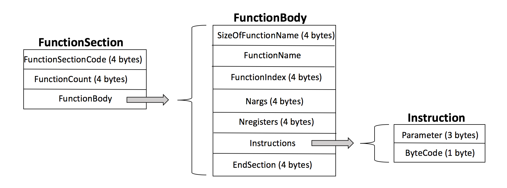

# The Base9 Frontend Compiler and Binary Format


## Frontend Compiler

The frontend compiler takes b9porcelain source code and using the [Esprima] framework, parses it into an Abstract Syntax Tree (AST). Although Esprima handles a significant chunk of the work, we must still go through and parse the AST to create our bytecodes. The parsing requires an understanding of AST's and the various node types as output by Esprima. The tree is processed recursively, and each node type is handled by a corresponding function. The frontend compiler eventually outputs a binary file which can later be deserialized and loaded into the VM. 

[Esprima]: http://esprima.org

To run the front-end compiler on a JavaScript program and output a binary module, we use:

`node ./compile.js <in> <out>`

Where `<in>` is the name/path of our JavaScript program, and `<out>` is the name we choose for our binary module. 

Lets have a look at our binary format.

## Binary Format

Please note that our decision to convert our b9porcelain program into a binary module was an independent design decision. It allows for cross platform compatibility, and gives us the option of packaging modules in their binary format, which is both fast to deserialize, and convenient.

The formal grammar for our binary format is as follows:

```
Module := Header *Section
Header := MagicNumber('b' '9' 'm' 'o' 'd' 'u' 'l' 'e') Section
Section := SectionCode SectionBody
SectionCode := FuncionSectionCode(uint32) | StringSectionCode(uint32)
SectionBody := FunctionSectionBody | StringSectionBody
FunctionSectionBody := FunctionCount(uint32) Function
Function := sizeofName (uint32) name(char*) functionIndex(uint32) nargs(uint32) nregs(uint32) *Instruction EndSection
Instruction := ByteCode(uint8) Immediate(uint24)
SectionCode:= StringSectionCode(uint32)
StringSectionBody := StringCount(uint32) StringTable
StringTable:= String
String:= sizeofString(uint32) String(char*)
```

### Binary Module Sections:


### Function Section:



### String Section:


### Binary Module Example:

```
62 39 6d 6f 64 75 6c 65  01 00 00 00 01 00 00 00  04 00 00 00 66 75 6e 63
00 00 00 00 00 00 00 00  00 00 00 00 01 00 00 0d  02 00 00 0d 00 00 00 09
00 00 00 02 00 00 00 00  02 00 00 00 01 00 00 00  04 00 00 00 63 6f 64 65
```
Lets walk through and understand what is being stored here. The first 8 bytes are the module header, and are made up of the ascii values for the letters in "b9module". The following 4 bytes, `01 00 00 00` are the 32-bit functionSectionCode, which indicates to the deserializer that the function section is to follow. The next 32-bit value, `01 00 00 00` is the functionCount, which tells the deserializer how many functions to read. Now come the functions. The next 32-bit value is `04 00 00 00`, and it indicates the size of the string to follow. As the strings in our binary module are not null terminated, we must first know their size in bytes in order to read them correctly. As per our grammar, this string is the name of the first (and in this case only) function. The ascii values of the following 4 bytes (`66 75 6e 63`) make up the word "func", which is the name of our function. After the name is the function index, which in this case is `00 00 00 00`. The next two 32-bit values are the argument and register counts. Both are `00 00 00 00`. 

Now come the bytecodes. All of the bytecodes are 32-bits, but are made up of two sections, the parameter, and the bytecode. Our first bytecode is `01 00 00 0d`. The first 3 bytes is the parameter, `01 00 00`, and the last byte is the bytecode, `0d`, which corresponds with INT_PUSH_CONSTANT. For a complete listing of our bytecodes and their corresponding hexidecimal values, please see [instructions.hpp] in the codebase. There are 4 more bytecodes in the module, all 32 bits long: `02 00 00 0d` (INT_PUSH_CONSTANT 2), `00 00 00 09` (INT_ADD, which doesn't take a parameter, but pops and adds the last 2 values pushed onto the stack and pushes the result), and `00 00 00 02` (FUNCTION_RETURN, which also doesn't take a parameter). 

[instructions.hpp]: https://github.com/b9org/b9/blob/master/b9/include/b9/instructions.hpp

Lastly is the END_SECTION marker, `00 00 00 00`. This marker indicates to the deserializer that it is finished reading the bytecodes of the current function. If there were more functions, it would begin again by reading the next function, starting with the function name. 

The final section in our binary module is the string section. It is indicated to the deserializer by the string section code `02 00 00 00`. The next 32-bits indicate the string count, which is `01 00 00 00`. After the deserializer reads the string count, it begins looping over the strings, which are stored (as with the function names) by a 32-bit size value, followed by the string. In our example, we can see that the first and only string in our string section will be 4 bytes long (`04 00 00 00`). The string itself is `63 6f 64 65` and represents the ascii encoding of the word "code". 
